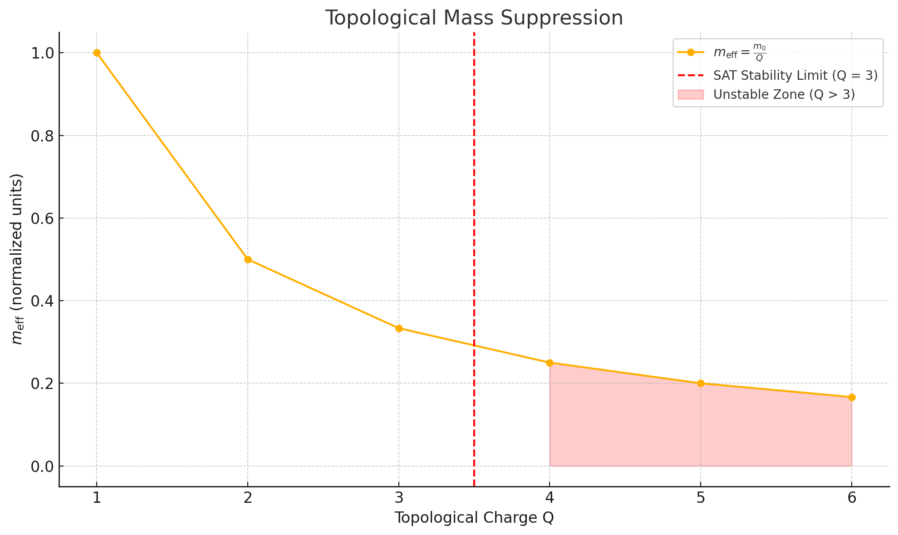
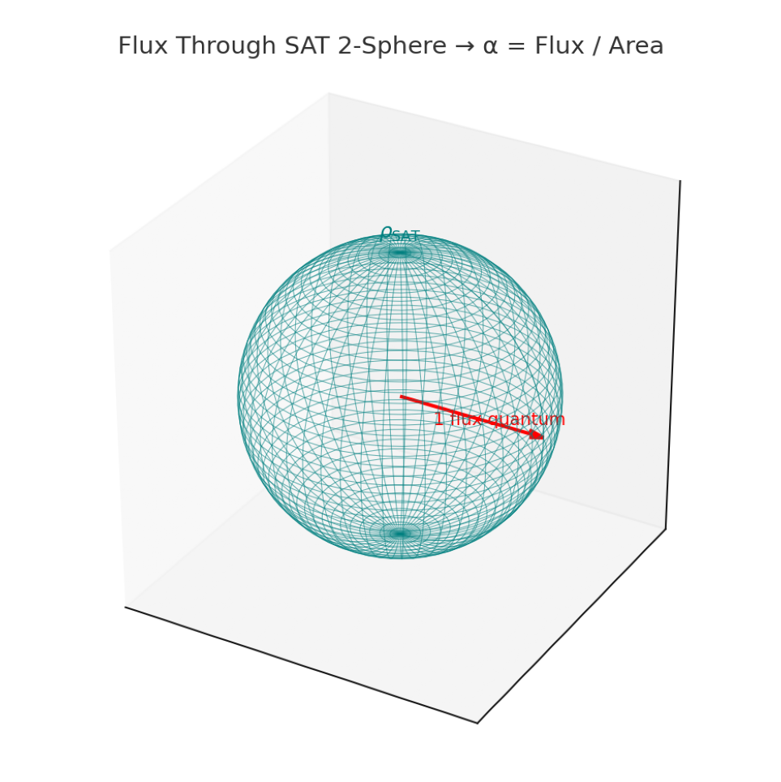
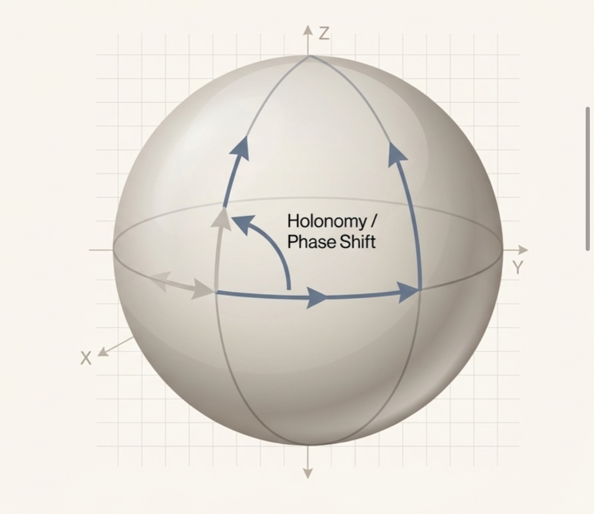
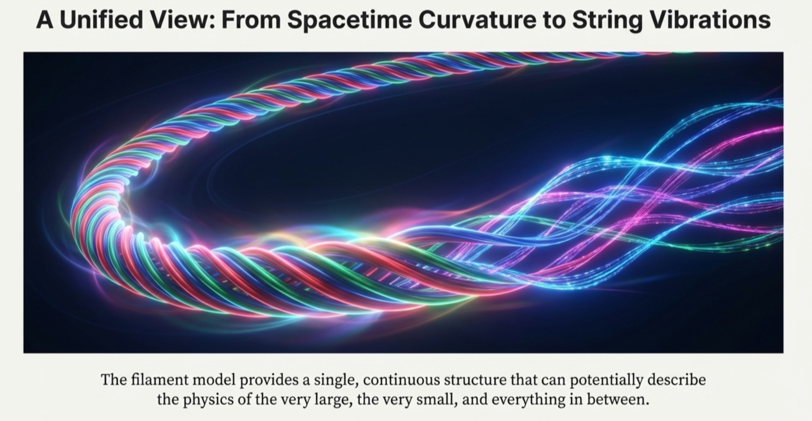

# SAT → H(s)H: a short development timeline

This is a **navigation timeline**, not a priority argument and not a claim that every current H(s)H statement was already explicit at every earlier stage. It compresses the much longer developmental timeline preserved in the historical SAT archive into the turning points most useful for understanding how the present construction arose.

The recurring thread is geometric: four-dimensional particle paths/worldlines, intersections with time slices or surfaces, coiling and higher-order structure, and progressively more explicit attempts to map known physics into that picture. The vocabulary, mathematics, and physical identifications became much more specific over time.

Where a surviving or later explanatory image closely matches a stage, it is linked directly into the timeline. **Historical images are identified as such; later explanatory visuals should not be read as evidence that their final rendering existed at the earlier date.**

<table>
<tr><th width="18%" align="right">Date</th><th width="4%"> </th><th>Turning point</th></tr>

<tr><td align="right"><strong>c. 1991</strong></td><td align="center">●</td><td><strong>Worldline / timesheet intuition.</strong> Original Minkowski particle-path visualization in four dimensions; early “worldline” and “timesheet” language.</td></tr>
<tr><td></td><td align="center">│</td><td></td></tr>

<tr><td align="right"><strong>Feb–Jun 2003</strong></td><td align="center">●</td><td><strong>Ireland-trip notebook.</strong> Surviving brane, dimensional, higher-dimensional, and coiled/path sketches. These are the earliest surviving notebook materials now used as direct visual provenance.  
&nbsp;
&nbsp;
 <small>Surviving 2003 source images — click through to the historical Archive.</small></td></tr>
<tr><td></td><td align="center">│</td><td></td></tr>

<tr><td align="right"><strong>Feb–Apr 2004</strong></td><td align="center">●</td><td><strong>Mass / curvature / time-path sketches.</strong> Moleskine-era notes explicitly develop curved-space light paths, particle-path geometry, mass/curvature intuition, and “path / time line / space curve” language.</td></tr>
<tr><td></td><td align="center">│</td><td></td></tr>

<tr><td align="right"><strong>Mar–Apr 2024</strong></td><td align="center">●</td><td><strong>Proto-SAT becomes explicit.</strong> Longstanding geometry is reopened in sustained AI-assisted work: line/plane intersection, helical-line geometry, worldline–hypersurface intersection, early SAT systematics, and explicit recognition that a Lagrangian/action treatment would eventually be needed.</td></tr>
<tr><td></td><td align="center">│</td><td></td></tr>

<tr><td align="right"><strong>Late 2024</strong></td><td align="center">●</td><td><strong>Stringing-Along Theory.</strong> Worldline/timesheet and filament vocabularies differentiate; the SAT/RMS relationship and toy-theory status are explicit; cross-temporal-force and physical-filament ideas are actively explored.</td></tr>
<tr><td></td><td align="center">│</td><td></td></tr>

<tr><td align="right"><strong>2 Feb 2025</strong></td><td align="center">●</td><td><strong>Fundamental Intuitions become public.</strong> Physicalized worldlines/filaments, time surface/timesheet, particle-as-intersection, four-dimensional trace as physical object, and the rule to import successful SM/GR/QM structure unless forced otherwise are presented publicly.</td></tr>
<tr><td></td><td align="center">│</td><td></td></tr>

<tr><td align="right"><strong>Feb–May 2025</strong></td><td align="center">●</td><td><strong>From picture to broad physics map.</strong> θ/θ₄, angular interaction, filament hierarchy, twist/torsion, particle cross-sections, “Worldline Geometry = Force Map,” SAT-to-standard maps, particle-sector work, and increasingly broad translation of established physics into the SAT grammar.  
&nbsp;
&nbsp;
&nbsp;
 <small>Contemporaneous notebook material from the 2025 formalization/translation period.</small></td></tr>
<tr><td></td><td align="center">│</td><td></td></tr>

<tr><td align="right"><strong>7–10 Jun 2025</strong></td><td align="center">●</td><td><strong>4D/SAT-O formalization burst.</strong> 4D-covariant integration, hyperhelical filaments, massless-particle/quark/meson reinterpretations, Hopf and Borromean structures, SAT-O modules, and a dedicated mathematical-backbone effort are assembled.  
&nbsp;
 <small>Related SAT explanatory visuals: particle geometry and braid-centered composite structure.</small></td></tr>
<tr><td></td><td align="center">│</td><td></td></tr>

<tr><td align="right"><strong>Jul–Aug 2025</strong></td><td align="center">●</td><td><strong>Consolidation and hostile testing.</strong> SAT.CLEAN, SAT.4D, SATO.4D, SAT-X, SAT Quantum and related branches are compared, simplified and stress-tested; prediction/retrodiction portfolios and explicit failure/constraint work expand.  
&nbsp;
 <small>Examples from the computational/analytical visual corpus; these illustrate the testing machinery rather than the entire phase.</small></td></tr>
<tr><td></td><td align="center">│</td><td></td></tr>

<tr><td align="right"><strong>Oct–Dec 2025</strong></td><td align="center">●</td><td><strong>Blockwave / One-Action phase and public archive.</strong> Constraint tightening, a one-action formulation, compact phase/holonomy language, geometric cosmological unfolding, and the compressed slogans “mass is misalignment / charge is twist / gravity is strain / motion is slicing” appear. The SAT Theory Archive becomes public on GitHub on 28 Dec 2025.  
&nbsp;
 <small>Related synthesis visuals: one geometric grammar across sectors and into cosmology.</small></td></tr>
<tr><td></td><td align="center">│</td><td></td></tr>

<tr><td align="right"><strong>Feb–Mar 2026</strong></td><td align="center">●</td><td><strong>4DHH / Universal Indicatrix.</strong> Hyperhelical reformulation, Unit Cell work, Standard Atom/He-3, photoneutrino sector, Universal Indicatrix/geometric-solver work, and a concentrated 4DHH formalization phase bring much of the prior machinery into a more explicitly geometric generator framework.  
&nbsp;
 <small>Related visuals from the hyperhelical / holonomy phase of the construction.</small></td></tr>
<tr><td></td><td align="center">│</td><td></td></tr>

<tr><td align="right"><strong>Jun 2026</strong></td><td align="center">●</td><td><strong>SAT 2026 synthesis.</strong> The archive records the working lineage as RMS → SAT → SAT-O → 4DHH → UI → SAT 2026, with extensive cleanup of versioning, terminology and archive navigation.</td></tr>
<tr><td></td><td align="center">│</td><td></td></tr>

<tr><td align="right"><strong>Summer 2026</strong></td><td align="center">●</td><td><strong>H(s)H: worldline → worldtube.</strong> The mature coiled-worldline skeleton is re-expressed as a finite-core Hyperhelical Worldtube construction. The goal is not to discard the earlier geometry, but to make its finite extent, internal structure, deformation and interaction mechanics explicit.  
&nbsp;
&nbsp;
 <small>Current explanatory visuals for the worldline-to-worldtube problem. These are conceptual guides, not dating evidence for the earlier stages.</small></td></tr>
<tr><td></td><td align="center">│</td><td></td></tr>

<tr><td align="right"><strong>Sep 2026</strong></td><td align="center">●</td><td><strong>Public-facing H(s)H and lineage audit.</strong> Work turns toward a clearer visual public presentation, finite-core formalization, and systematic prior-art/citation review after recognizing substantial overlap with a longstanding braid/topology/higher-geometry research lineage.  
&nbsp;
 <small>Public-facing synthesis and braid-language visuals used in the current presentation layer.</small></td></tr>
</table>

## How to read the timeline

Three things should not be collapsed into one another:

- **geometric continuity** — what recognizable construction persists through the record;
- **technical development** — when terminology, equations, solvers and explicit mappings were added;
- **historical priority / prior art** — what external work already contained the same ingredients or compounds.

The long-form source timeline in the historical archive is substantially more granular and includes conversations, notebooks, files, version labels, formalization attempts, tests, corrections and abandoned branches.

**Primary historical source:** [SAT Theory Archive 2023–25](https://github.com/Satobloc/SAT_THEORY_ARCHIVE_2023-25#development-timeline)

**Earliest surviving sketch set:** [2003 SKETCHES](https://github.com/Satobloc/SAT_THEORY_ARCHIVE_2023-25/tree/main/2003%20SKETCHES)

**Current visual introduction:** [H(s)H front page](README.md)
