# H(s)H — Hyper(super)Helical Worldtube

**A visual-first reconstruction of the SAT → H(s)H geometry.**

<table>
<tr>
<td>
<strong>👋 Welcome — here’s what we have</strong>  
SAT/H(s)H is an <strong>open research program under active development</strong>, not a peer-reviewed theory.  
The conceptual descriptions here are intended to represent the model as Nathan McKnight understands and intends it. The archive also contains extensive mathematical derivations, calculations, computational experiments, geometric constructions, revisions, and attempted formalizations.  
<strong>Those mathematical results have not yet received comprehensive independent expert vetting.</strong> Some have been checked repeatedly by LLMs or computational tools; some have partial or preliminary review; others remain queued for examination. We do not treat polished presentation, repeated derivation, or agreement among AI systems as a substitute for qualified human review or formal verification.  
Rather than hide that uncertainty, this library exposes it. Each major document carries a <strong>vetting status</strong> showing what kinds of review have actually occurred, and those statuses will be updated as derivations are recovered, reproduced, challenged, formally checked, or reviewed by specialists.  
The archive is here to be read, tested, criticized, corrected, and improved.
</td>
</tr>
</table>

H(s)H is the current finite-core/worldtube continuation of the SAT research program. The project starts from a literal geometric reading of Minkowski spacetime and asks how far the known structure of physics can be recovered by following the geometry, projection, motion, coiling, braiding, and interaction rules before importing additional interpretive machinery.

The images below are not decorative. They are the fastest way into the construction. They show the recurring picture that runs through the SAT record: a trajectory through four-dimensional geometry, its intersection/readout on a time surface, increasing structural complexity through coiling and braiding, and the extension of the same grammar from particle-scale structures to interaction and cosmology.

## Read the theory

<table>
<tr>
<td width="25%" valign="top"><strong>Start with the idea</strong> <a href="https://github.com/Satobloc/SAT_THEORY_ARCHIVE_2023-25/blob/main/THE%20FUNDAMENTAL%20INTUITIONS%20%E2%80%94%20EXTENDED.pdf">The Fundamental Intuitions — Extended</a> <small>Foundational conceptual statement.</small></td>
<td width="25%" valign="top"><strong>Formal SAT presentation</strong> <a href="https://github.com/Satobloc/SAT_THEORY_ARCHIVE_2023-25/blob/main/FULL_THEORY.pdf">FULL_THEORY.pdf</a> <small>Compact mathematical presentation; awaiting independent vetting.</small></td>
<td width="25%" valign="top"><strong>Trace the derivations</strong> <a href="https://github.com/Satobloc/SAT_THEORY_ARCHIVE_2023-25/blob/main/..%5B%F0%9F%8E%9B%EF%B8%8F_NATHAN_DASH%5D/..Derivation_Index.md">Derivation / provenance index</a> <small>Map from major claims to source derivation attempts.</small></td>
<td width="25%" valign="top"><strong>Current H(s)H</strong> <a href="synthesis/CURRENT_SYNTHESIS.md">Current synthesis</a> <small>Living reconstruction of the finite-core worldtube program.</small></td>
</tr>
</table>

> **Read the pictures first if you want the fastest conceptual route.** The history, source record, formal work, current status, and growing document library are linked around and beneath them.

---

## 1. One geometric construction, many familiar descriptions

<a href="https://github.com/Satobloc/SAT_THEORY_ARCHIVE_2023-25/tree/main/SAT%20VISUALS">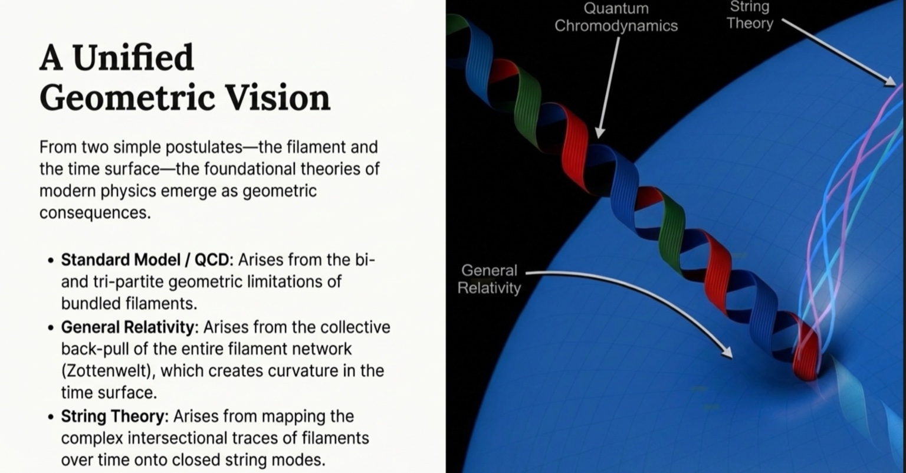</a>

SAT's organizing move is not to invent a separate geometric story for every physical sector. It asks whether familiar descriptions can be understood as different projections, interaction regimes, or effective descriptions of one underlying geometric construction. The labels in historical figures should be read as **SAT mappings and research claims**, not as a substitute for the standard theories themselves.

---

## 2. Particle differences as differences of geometry

<a href="https://github.com/Satobloc/SAT_THEORY_ARCHIVE_2023-25/tree/main/SAT%20VISUALS">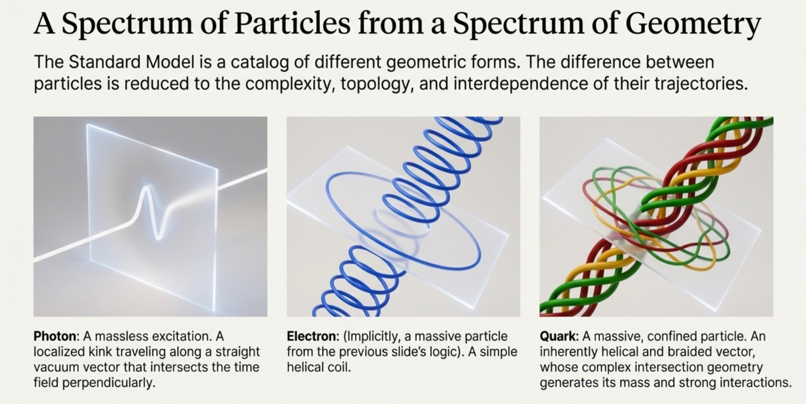</a>

A recurring SAT idea is that the apparent catalog of particle types may be reorganized as a catalog of trajectory geometries: simple traveling excitation, persistent coiling, and increasingly interdependent or braided structures. The current H(s)H program is working to replace the simplified centerline picture with a finite-core worldtube treatment while preserving the same geometric dependency structure.

---

## 3. The basic readout: trajectory and time-surface intersection

<a href="https://github.com/Satobloc/SAT_THEORY_ARCHIVE_2023-25/tree/main/SAT%20VISUALS">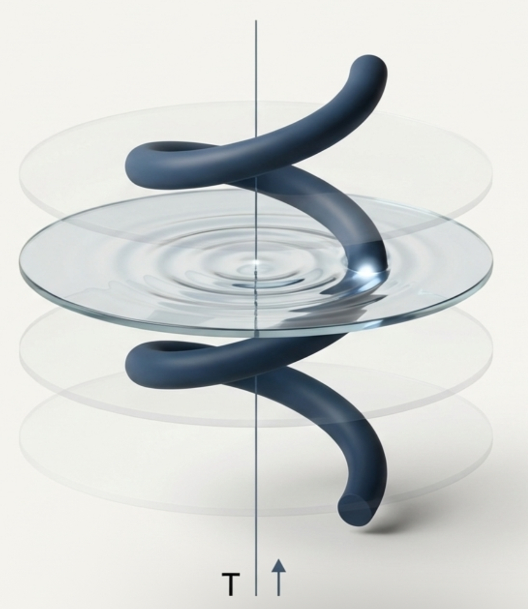</a>

The basic visual grammar is a higher-dimensional trajectory intersecting a lower-dimensional time slice or readout surface. The intersection can move, rotate, close, open, or change shape even when the underlying trajectory remains continuous.

<a href="https://github.com/Satobloc/SAT_THEORY_ARCHIVE_2023-25/tree/main/SAT%20VISUALS">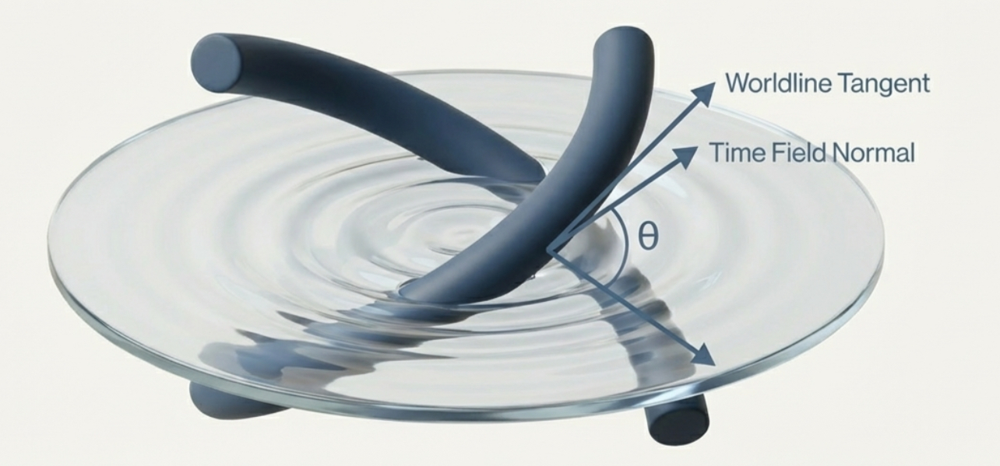</a>

Historically SAT used an angular measure, usually written **θ₄**, to track the orientation of the trajectory relative to the time direction/surface normal. The notation and exact formal role have evolved; the geometric relationship is the durable part of the picture.

---

## 4. Not just a straight helix: recursion and carrier geometry

<a href="https://github.com/Satobloc/SAT_THEORY_ARCHIVE_2023-25/tree/main/SAT%20VISUALS">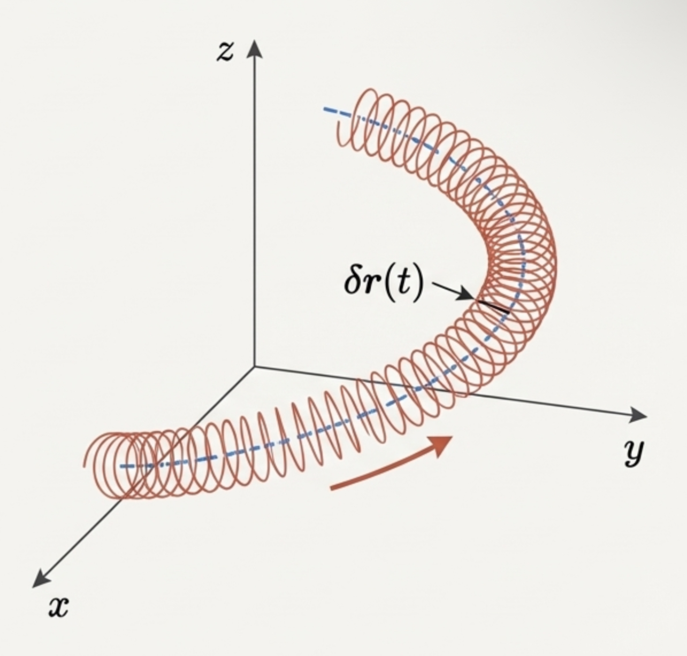</a>

The model is not simply "everything is a helix." A local coil may itself propagate along a curved carrier, and that carrier may participate in still larger-scale structure. The present H(s)H work is focused on making this recursive, finite-core geometry explicit rather than leaving it compressed into a worldline skeleton.

---

## 5. Interaction as geometric braiding

<a href="https://github.com/Satobloc/SAT_THEORY_ARCHIVE_2023-25/tree/main/SAT%20VISUALS">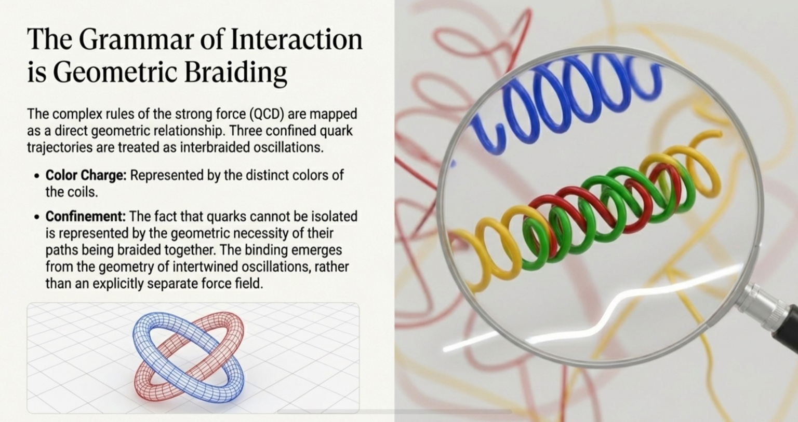</a>

SAT's braid-centered interaction picture treats multi-filament organization as a geometric relation rather than merely adding a new label to otherwise independent particles. In the historical worldline model this was represented by interweaving centerlines; H(s)H asks what the corresponding finite-core worldtube mechanics actually are: **bundle geometry + finite extent + intersection/readout + deformation**.

---

## 6. A worldline can generate an evolving family of observed patterns

<a href="https://github.com/Satobloc/SAT_THEORY_ARCHIVE_2023-25/tree/main/SAT%20VISUALS">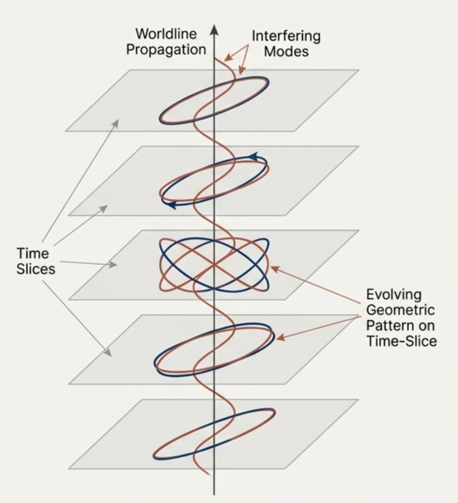</a>

Successive slices through one continuous construction need not look alike. SAT repeatedly uses this fact to distinguish the full trajectory from the lower-dimensional pattern available at any one slice. The same distinction is central to the move from worldline to worldtube.

---

## 7. The construction is intended to close at cosmological scale

<a href="https://github.com/Satobloc/SAT_THEORY_ARCHIVE_2023-25/tree/main/SAT%20VISUALS">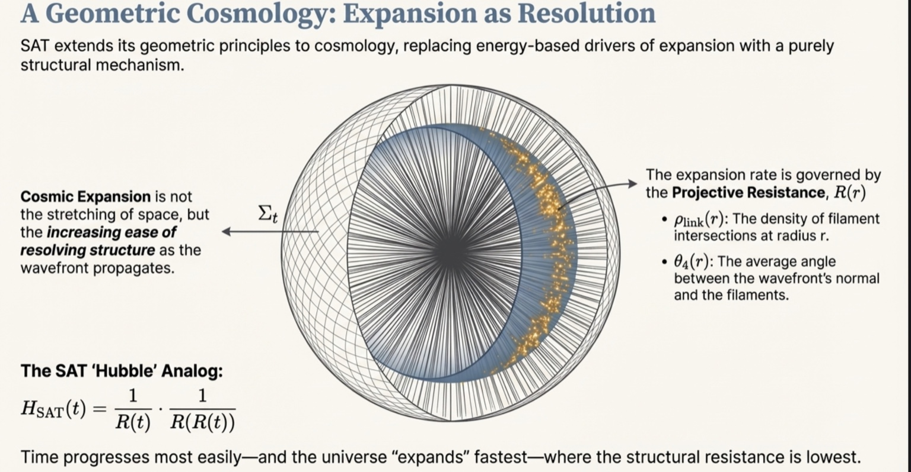</a>

SAT was developed as a whole-physics translation program rather than a particle model alone. Its historical materials therefore extend the same geometric vocabulary into gravitation, large-scale structure, expansion, fluids, and cosmology. Some specific equations and historical mechanisms have since been revised or retired; the broad structural ambition remains part of H(s)H.

---

## 8. Historical continuity is part of the record

The public H(s)H repository is not the primary historical archive. The larger [SAT Theory Archive 2023–25](https://github.com/Satobloc/SAT_THEORY_ARCHIVE_2023-25) preserves the developmental record. The quick provenance window below deliberately spans both ends of that record: surviving 2003 material and the much more explicit 2025 SAT notebooks.

### Earliest surviving notebook/sketch material — 2003

<table>
<tr>
<td width="33%" valign="top"></td>
<td width="33%" valign="top"></td>
<td width="33%" valign="top"></td>
</tr>
</table>

The Archive dates the Ireland-trip notebook period to **February–June 2003** and preserves the surviving sketches as their own source layer. The point here is not to retrofit every later SAT term onto those pages, but to show the early geometric ancestry directly rather than beginning the visual history in 2025.

### Explicit SAT notebook development — 2025

<table>
<tr>
<td width="25%" valign="top"><a href="https://github.com/Satobloc/SAT_THEORY_ARCHIVE_2023-25/tree/main/SAT%20VISUALS">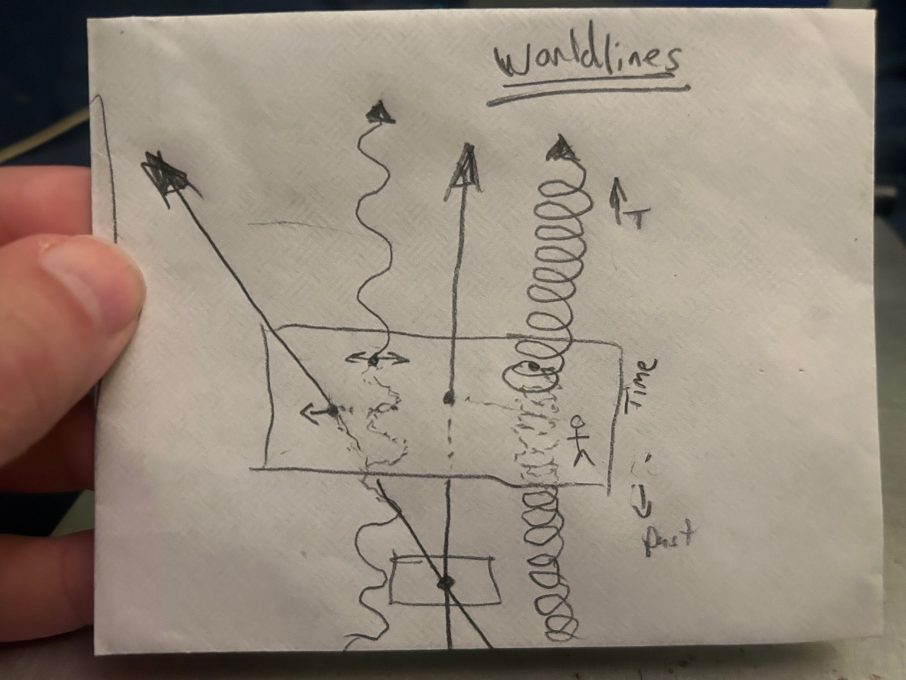</a></td>
<td width="25%" valign="top"><a href="https://github.com/Satobloc/SAT_THEORY_ARCHIVE_2023-25/tree/main/SAT%20VISUALS">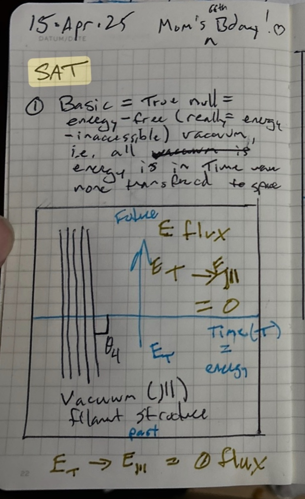</a></td>
<td width="25%" valign="top"><a href="https://github.com/Satobloc/SAT_THEORY_ARCHIVE_2023-25/tree/main/SAT%20VISUALS">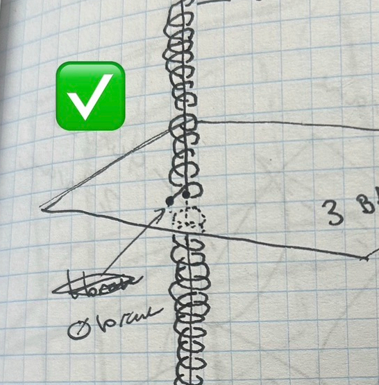</a></td>
<td width="25%" valign="top"><a href="https://github.com/Satobloc/SAT_THEORY_ARCHIVE_2023-25/tree/main/SAT%20VISUALS">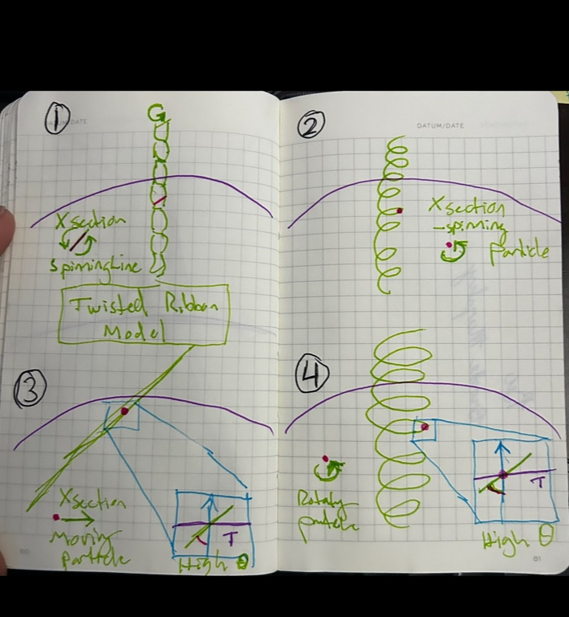</a></td>
</tr>
</table>

The point of preserving the sketches alongside later renderings is not that every current H(s)H statement was already explicit in the earliest work. It is that the **recognizable generative geometry appears early and persists while the physical identifications, mathematical machinery, and resolution of the model accumulate around it**.

[Browse the 2003 sketch folder →](https://github.com/Satobloc/SAT_THEORY_ARCHIVE_2023-25/tree/main/2003%20SKETCHES) · [Browse the historical SAT visuals →](https://github.com/Satobloc/SAT_THEORY_ARCHIVE_2023-25/tree/main/SAT%20VISUALS) · [Browse the curated H(s)H visual package →](SAT_VISUALS/VISUALS_1/)

---

# History in brief

SAT/H(s)H did not begin as a finished theory and then acquire illustrations afterward. The geometry came first and was repeatedly revisited, renamed, formalized, tested, simplified, and broadened. The historical archive records the path in much greater detail, but several turning points make the overall development legible:

**c. 1991 → 2003–04:** Minkowski worldline/timesheet thinking develops into surviving higher-dimensional path, coil, mass and curvature sketches.

**2024:** the old construction is reopened explicitly as Proto-SAT; line/plane and helix/hypersurface geometry becomes the center of sustained theory-building.

**2 February 2025:** the Fundamental Intuitions are presented publicly: physicalized worldlines/filaments, a time surface, particle-as-intersection, and deliberate import of successful Standard Model, relativity and quantum structure.

**Spring–summer 2025:** SAT expands rapidly into an all-physics translation program. θ₄, torsion/twist, particle mappings, QCD-like locking/braiding, 4D-covariant integration, Hopf/Borromean structures, SAT-O modules, mathematical-backbone work, prediction protocols and hostile audits all enter the record.

**Late 2025:** Blockwave and One-Action formulations compress the picture further; the public archive opens on GitHub on 28 December 2025.

**Early 2026:** 4DHH, the Universal Indicatrix, Unit Cell work, photoneutrino and Standard Atom constructions reorganize much of the prior machinery around a more explicitly hyperhelical geometric generator.

**Summer 2026 → H(s)H:** the longstanding coiled-worldline skeleton is carried into a finite-core **Hyperhelical Worldtube** model so that internal extent, deformation, interaction and recursive carrier structure can be treated explicitly rather than only through a centerline representation.

For the compact visual chronology, see **[SAT → H(s)H: a short development timeline](HISTORY_TIMELINE.md)**. The long-form source chronology remains in the [historical SAT Archive](https://github.com/Satobloc/SAT_THEORY_ARCHIVE_2023-25#development-timeline).

---

# Current H(s)H focus

The present research problem is the finite-core worldtube build: preserving the durable geometric structure of the worldline model while determining which relations survive, which require new mechanics, and which historical simplifications should be retired. Mathematical formalization, empirical comparison, and prior-art review are proceeding alongside that reconstruction.

For readers who want to go deeper:

- [Short development timeline](HISTORY_TIMELINE.md)
- [Repository architecture](ARCHITECTURE.md)
- [Structural index](indexes/STRUCTURAL_INDEX.md)
- [Formalization workspace](formalization/README.md)
- [Curated visual package](SAT_VISUALS/VISUALS_1/)
- [Historical SAT Theory Archive 2023–25](https://github.com/Satobloc/SAT_THEORY_ARCHIVE_2023-25)

Contributor/LLM workflow notes, maintenance rules, source-handling instructions and internal navigation have been moved to [`INTERNAL/WORKING_INSTRUCTIONS.md`](INTERNAL/WORKING_INSTRUCTIONS.md) so the public front page can remain a scientific introduction rather than an operations manual.

---

# SAT/H(s)H CLARIFICATIONS

*A note from Nathan McKnight*

1. Although we have at times explored the possibility of a 24-cell lattice, I have always found that construction somewhat artificial on its face. We have therefore placed it on the back burner unless and until the geometry itself forces something like it as the H(s)H model is built out.

2. We see no inherent conflict between SAT/H(s)H and mainstream physics. Quite the opposite: the extraordinary empirical success, mathematical structure, and cumulative data of modern physics form the most important foundation for this work. SAT/H(s)H began from a literal reading of Minkowski spacetime, itself foundational to special relativity and deeply embedded in the structure of General Relativity.

3. SAT/H(s)H deliberately builds on classical and relativistic thinking and takes mainstream physics as the clearest and most complete picture of the universe currently available. We began by trying only to map known physics geometrically in four dimensions. In hindsight, however, constructing such a map also created a constrained vantage point from which to ask where apparently disconnected descriptions might fit together, and where the standard picture might still be incomplete.

4. Although SAT/H(s)H may eventually contribute scientifically, I regard my primary contribution as methodological and philosophical: insistence on minimalism, reduction of the problem space, and the possibility that the conceptual and mathematical tools already available to us may be sufficient to build a coherent understanding of the universe. That did not have to be true. But repeatedly, removing unnecessary ornament has produced not merely a fuller picture, but a simpler one.

5. SAT/H(s)H was developed almost entirely from within its own Minkowski-geometric grammar. Along the way it repeatedly converged, often unexpectedly, on structures that already exist in established mathematics and mathematical physics. I do not take that as evidence of special insight by itself. I take it first as evidence that good geometry tends to lead people toward the same places. In that sense, the recurring answer to “why did we keep landing here?” may be very simple: because Minkowski was right.

6. If SAT/H(s)H is eventually shown to fit evidence more closely than it must merely by reproducing established physics, then its contribution may prove scientific in the stronger sense I hope for. The most distinctive candidate ideas include photon–neutrino duality, a recycling black-hole cosmology, and the relocation of spacetime curvature into the geometry of the time surface. These remain claims to be tested, not conclusions to be assumed.

7. We have done our best to construct the mathematical backbone using classical equations, modern formalisms, and our own geometric solvers. We do not, however, claim the specialized mathematical expertise required to vet every derivation with the confidence appropriate to peer review. For that reason we have preferred open development: making the reasoning, mistakes, revisions, dead ends, and corrections as visible as possible. Having recently recognized that parts of our work overlap a century-old mathematical and physical lineage involving braid theory and related formalisms, we are temporarily directing substantial attention away from theory-building and toward prior-art review and proper citation. Some ideas we believed to be unusual may prove to have substantial precedent. If so, that should be acknowledged plainly. I hope the overall construction may nonetheless remain distinctive in conception and synthesis.

8. Over the last year and a half, we have made visible not only the work itself, but also our ineptitude, stubbornness, personal struggles, wrong turns, jokes, and occasionally embarrassing degree of obsession with this picture of reality. Against our own expectations, that process has also revealed peers, predecessors, colleagues, and a broader intellectual community working on related structures. Outsider and academic work alike rests on generations of people who opened conceptual paths long before us. Exploratory work has value even when later evidence rejects it, because science advances not only through answers but through the disciplined expansion and contraction of the space of possible answers.

> **The one thing science cannot do without is wonder: wonder at the complexity of this place, and at the possibility that beneath that complexity lies something unexpectedly simple.**

---

# SAT/H(s)H Library

This is a curated front-door collection, not a declaration of canon. Documents are included because they are useful for understanding the conceptual construction, mathematical formalization, derivation history, or current H(s)H rebuild. Status panels will be updated as papers are connected to their derivation attempts and as those derivations receive additional review.

**Vetting scale:**  grey = queued ·  blue = preliminary review ·  green = substantive review milestone ·  red = review complete. Pale boxes are inactive; saturated boxes are active.

> **These colors show review progress, not whether the underlying model is physically true.** Questions, caveats, discrepancies, and failed checks are recorded in the document annotation and linked audit/derivation records rather than encoded as warning colors.

## Conceptual foundations

### [The Fundamental Intuitions — Extended](https://github.com/Satobloc/SAT_THEORY_ARCHIVE_2023-25/blob/main/THE%20FUNDAMENTAL%20INTUITIONS%20%E2%80%94%20EXTENDED.pdf)
**Document status:** `FOUNDATIONAL CONCEPT`  
Short, direct statement of the durable SAT picture: complete filament/worldline histories, the resolving time surface, particle-as-intersection, interaction/backreaction, and the helical recording of deformation.

<table><tr><td><strong>VETTING STATUS</strong>  <strong>LLM / COMPUTATIONAL</strong>     <strong>HUMAN / SPECIALIST</strong>     <strong>FORMAL</strong>    </td></tr></table>

### [The Logic of SAT](https://github.com/Satobloc/SAT_THEORY_ARCHIVE_2023-25/blob/main/THE%20LOGIC%20OF%20SAT.txt)
**Document status:** `CONCEPTUAL MAP`  
A structured explanation of the intended object hierarchy and reasoning chain. Especially useful for understanding how the early model connects worldlines, the time surface, intersectional particles, backreaction, mass, forces, GR, and QM. Some ontological language is stronger than the present H(s)H stance.

<table><tr><td><strong>VETTING STATUS</strong>  <strong>LLM / COMPUTATIONAL</strong>     <strong>HUMAN / SPECIALIST</strong>     <strong>FORMAL</strong>    </td></tr></table>

## Mathematical and formal presentations

### [FULL_THEORY.pdf](https://github.com/Satobloc/SAT_THEORY_ARCHIVE_2023-25/blob/main/FULL_THEORY.pdf)
**Document status:** `HISTORICAL FORMALIZATION` · `UNDER AUDIT`  
One of the clearest paper-style attempts to present superhelical parameterization, curvature/torsion, projections, coupling metrics, proposed invariants, applications, and tests in one place. Preliminary review has identified places where the displayed derivation chain needs to be connected to the broader archive before stronger claims can be assessed.

<table><tr><td><strong>VETTING STATUS</strong>  <strong>LLM / COMPUTATIONAL</strong>     <strong>HUMAN / SPECIALIST</strong>     <strong>FORMAL</strong>    </td></tr></table>

### [SAT CORE.pdf](https://github.com/Satobloc/SAT_THEORY_ARCHIVE_2023-25/blob/main/%20..%E2%9C%85%20SAT%20CORE.pdf)
**Document status:** `HISTORICAL FORMALIZATION` · `UNDER AUDIT`  
A compact intended mature architecture spanning the time-flow field, θ₄, phase/twist fields, coupled action, mass mechanism, gauge reconstruction, cosmology, and falsification claims. Useful as a map of what the formal program was trying to accomplish; several stated closures point outward to derivation work that still needs to be reconnected and assessed.

<table><tr><td><strong>VETTING STATUS</strong>  <strong>LLM / COMPUTATIONAL</strong>     <strong>HUMAN / SPECIALIST</strong>     <strong>FORMAL</strong>    </td></tr></table>

### [MINKOWSKI PROPER.pdf](https://github.com/Satobloc/SAT_THEORY_ARCHIVE_2023-25/blob/main/MINKOWSKI%20PROPER.pdf)
**Document status:** `METHODOLOGICAL / FORMALIZATION SOURCE` · `UNDER AUDIT`  
Important for the procedural ambition of beginning from established four-dimensional worldline geometry and constraining extensions geometrically. Later portions incorporate several SAT constants and mechanisms whose displayed derivation chains still need reconstruction.

<table><tr><td><strong>VETTING STATUS</strong>  <strong>LLM / COMPUTATIONAL</strong>     <strong>HUMAN / SPECIALIST</strong>     <strong>FORMAL</strong>    </td></tr></table>

### [Relativistic–Quantum Isomorphism (nolat).pdf](https://github.com/Satobloc/SAT_THEORY_ARCHIVE_2023-25/blob/main/Relativistic%E2%80%93Quantum%20Isomorphism%20%28nolat%29.pdf)
**Document status:** `MAJOR DERIVATION TARGET` · `UNDER AUDIT`  
A particularly important proposed bridge between constrained geometric motion, spectral modes, and a shared variational structure. It is being retained prominently because both the claimed correspondence and the historical Whirligig-assisted route used to reach it deserve direct reconstruction and comparison with conventional calculation.

<table><tr><td><strong>VETTING STATUS</strong>  <strong>LLM / COMPUTATIONAL</strong>     <strong>HUMAN / SPECIALIST</strong>     <strong>FORMAL</strong>    </td></tr></table>

### [DIMENSIONAL_NORMALIZATION.pdf](https://github.com/Satobloc/SAT_THEORY_ARCHIVE_2023-25/blob/main/DIMENSIONAL_NORMALIZATION.pdf)
**Document status:** `CURRENT FORMAL TOOL`  
A September 2026 normalization protocol intended to keep representations lossless and to distinguish genuine residual structure from artifacts of scaling, coordinate choice, or normalization. It is a formal tool for the rebuild rather than a derivation of H(s)H physics.

<table><tr><td><strong>VETTING STATUS</strong>  <strong>LLM / COMPUTATIONAL</strong>     <strong>HUMAN / SPECIALIST</strong>     <strong>FORMAL</strong>    </td></tr></table>

## Current H(s)H working architecture

### [Current H(s)H synthesis](synthesis/CURRENT_SYNTHESIS.md)
**Document status:** `CURRENT WORKING SYNTHESIS`  
The living reconstruction layer. This is the best current route into what has survived the SAT → H(s)H transition, what remains open, and how the finite-core worldtube architecture is being rebuilt.

<table><tr><td><strong>VETTING STATUS</strong>  <strong>LLM / COMPUTATIONAL</strong>     <strong>HUMAN / SPECIALIST</strong>     <strong>FORMAL</strong>    </td></tr></table>

Supporting working sources: [H(s)H 2026 STARTUP DOCS](https://github.com/Satobloc/SAT_THEORY_ARCHIVE_2023-25/blob/main/H%28s%29H%202026%20STARTUP%20DOCS.txt) · [H(s)H REWORK](https://github.com/Satobloc/SAT_THEORY_ARCHIVE_2023-25/blob/main/H%28s%29H%20Dev%20%2B/H%28s%29H%20REWORK.txt) · [HsH ARCHITECTING](https://github.com/Satobloc/SAT_THEORY_ARCHIVE_2023-25/blob/main/H%28s%29H%20Dev%20%2B/HsH%20ARCHITECTING.txt)

## Derivations, provenance, and further reading

- [Expanded SAT/H(s)H Library](LIBRARY.md) — additional snapshots, calculations, derivation sources, transition documents, working conversations, and formalization material selected for easier discovery.
- [Derivation / provenance index](https://github.com/Satobloc/SAT_THEORY_ARCHIVE_2023-25/blob/main/..%5B%F0%9F%8E%9B%EF%B8%8F_NATHAN_DASH%5D/..Derivation_Index.md) — maps major mathematical claims to likely derivation/provenance paths and current audit posture.
- [Mathematical Repository](https://github.com/Satobloc/SAT_THEORY_ARCHIVE_2023-25/blob/main/..MATHEMATICAL_REPOSITORY) — equation/provenance clearinghouse.
- [Annotated cross-archive survey](https://github.com/Satobloc/SAT_THEORY_ARCHIVE_2023-25/blob/main/!_ANNOTATED_ARCHIVE_SURVEY.md) — neutral coverage and provenance map.
- [Detailed surveyed-sources ledger](synthesis/SURVEYED_SOURCES.md) — what has actually been read, partially read, merely located, or identified as duplicate.
- [Historical SAT Theory Archive 2023–25](https://github.com/Satobloc/SAT_THEORY_ARCHIVE_2023-25) — the broader developmental record, including sector papers, derivation attempts, conversations, code, visualizations, and failed or superseded branches.

This library is intentionally incomplete. Additional sector papers, solver documents, historical formalizations, prediction papers, and primary conversations will be added as their roles and derivation relationships are mapped.