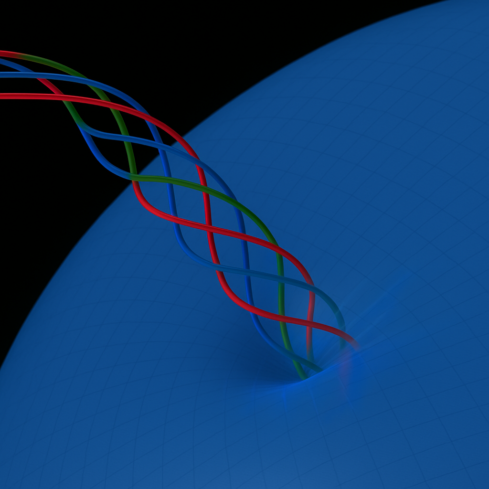

# H(s)H — Hyper(super)Helical Worldtube

**A visual-first reconstruction of the SAT → H(s)H geometry.**

H(s)H is the current finite-core/worldtube continuation of the SAT research program. The project starts from a literal geometric reading of Minkowski spacetime and asks how far the known structure of physics can be recovered by following the geometry, projection, motion, coiling, braiding, and interaction rules before importing additional interpretive machinery.

The images below are not decorative. They are the fastest way into the construction. They show the recurring picture that runs through the SAT record: a trajectory through four-dimensional geometry, its intersection/readout on a time surface, increasing structural complexity through coiling and braiding, and the extension of the same grammar from particle-scale structures to interaction and cosmology.

> **Read the pictures first.** The formalism, provenance, source trails, and current status are linked underneath them.

---

## 1. One geometric construction, many familiar descriptions

SAT's organizing move is not to invent a separate geometric story for every physical sector. It asks whether familiar descriptions can be understood as different projections, interaction regimes, or effective descriptions of one underlying geometric construction. The labels in historical figures should be read as **SAT mappings and research claims**, not as a substitute for the standard theories themselves.

---

## 2. Particle differences as differences of geometry

A recurring SAT idea is that the apparent catalog of particle types may be reorganized as a catalog of trajectory geometries: simple traveling excitation, persistent coiling, and increasingly interdependent or braided structures. The current H(s)H program is working to replace the simplified centerline picture with a finite-core worldtube treatment while preserving the same geometric dependency structure.

---

## 3. The basic readout: trajectory and time-surface intersection

The basic visual grammar is a higher-dimensional trajectory intersecting a lower-dimensional time slice or readout surface. The intersection can move, rotate, close, open, or change shape even when the underlying trajectory remains continuous.

Historically SAT used an angular measure, usually written **θ₄**, to track the orientation of the trajectory relative to the time direction/surface normal. The notation and exact formal role have evolved; the geometric relationship is the durable part of the picture.

---

## 4. Not just a straight helix: recursion and carrier geometry

The model is not simply "everything is a helix." A local coil may itself propagate along a curved carrier, and that carrier may participate in still larger-scale structure. The present H(s)H work is focused on making this recursive, finite-core geometry explicit rather than leaving it compressed into a worldline skeleton.

---

## 5. Interaction as geometric braiding

SAT's braid-centered interaction picture treats multi-filament organization as a geometric relation rather than merely adding a new label to otherwise independent particles. In the historical worldline model this was represented by interweaving centerlines; H(s)H asks what the corresponding finite-core worldtube mechanics actually are.

This is the transition the current work is trying to formalize: **bundle geometry + finite extent + intersection/readout + deformation**.

---

## 6. A worldline can generate an evolving family of observed patterns

Successive slices through one continuous construction need not look alike. SAT repeatedly uses this fact to distinguish the full trajectory from the lower-dimensional pattern available at any one slice. The same distinction is central to the move from worldline to worldtube.

---

## 7. The construction is intended to close at cosmological scale

SAT was developed as a whole-physics translation program rather than a particle model alone. Its historical materials therefore extend the same geometric vocabulary into gravitation, large-scale structure, expansion, fluids, and cosmology. Some specific equations and historical mechanisms have since been revised or retired; the broad structural ambition remains part of H(s)H.

---

## 8. Historical continuity is part of the record

The public H(s)H repository is not the primary historical archive. The larger [SAT Theory Archive 2023–25](https://github.com/Satobloc/SAT_THEORY_ARCHIVE_2023-25) preserves the developmental record. The images below are included here only as a quick provenance window into that history.

<table>
<tr>
<td width="33%" valign="top"></td>
<td width="33%" valign="top"></td>
<td width="33%" valign="top"></td>
</tr>
</table>

The point of preserving the sketches alongside later renderings is not that every current H(s)H statement was already explicit in the earliest work. It is that the **recognizable generative geometry appears early and persists while the physical identifications, mathematical machinery, and resolution of the model accumulate around it**.

[Browse the historical SAT visuals →](https://github.com/Satobloc/SAT_THEORY_ARCHIVE_2023-25/tree/main/SAT%20VISUALS)

[Browse the curated H(s)H visual package →](SAT_VISUALS/VISUALS_1/)

---

# What H(s)H is working on now

The immediate problem is to turn the comparatively mature **worldline skeleton** into a mathematically controlled **finite-core worldtube model** without laundering later-discovered outside machinery into the theory's premises.

The working order is:

**geometry → admissible relations → finite-core object → interaction/deformation → projection/readout → mathematical representation → comparison with known physics**

The project distinguishes representation, derivation, calibration, prediction, and prior-art comparison. A visually suggestive correspondence is not by itself a derivation or empirical result.

## Start here after the pictures

1. Read [ARCHITECTURE.md](ARCHITECTURE.md) for repository layers and status rules.
2. Use [the structural index](indexes/STRUCTURAL_INDEX.md) to see what is present.
3. Use [the executable equation registry](formalization/README.md) for curated Python checks and generated Lean obligations.
4. Treat `DEVELOPMENT_FULL_CONVOS/` as primary developmental source material, not as automatically current or canonical theory.
5. Use the point-of-use [citation ledger](ledgers/CITATION_LEDGER.md) when an outside source is required.
6. For the public visual vocabulary, start in [`SAT_VISUALS/VISUALS_1`](SAT_VISUALS/VISUALS_1/).

## Source relationship and prior-art boundary

- **This repository** is the clean destination for the developing H(s)H synthesis.
- The larger [SAT Theory Archive 2023–25](https://github.com/Satobloc/SAT_THEORY_ARCHIVE_2023-25) remains the historical/developmental archive and mathematical quarry.
- `HSH_RESOURCES` is the source-side research library for papers, datasets, prior art, and external comparison.
- H(s)H is reconstructed forward from its own SAT → SAT-O → 4DHH → Blockwave/Satobloc → H(s)H development.
- External literature is used for citation, standard definitions/results, empirical constraints, prior-art comparison, and explicitly provenance-labeled imports. It does not silently become H(s)H's generative basis.

When an outside source is used, two relationships remain separate:

**internal provenance** — where the H(s)H statement came from in the SAT/H(s)H record;

**external citation** — what standard result, empirical source, constraint, comparison, or prior art should be credited.

## Reading rule

**Observe → Catalog → Contextualize → Evaluate.**

Indexes describe what is present. They do not decide what is correct, current, derived, or physically established.

<strong>Repository maintenance and navigation</strong>

### Current contents

- `DEVELOPMENT_FULL_CONVOS/` — exported conversations and associated source artifacts.
- `LIVE CONVOS/` — mutable/current conversation material; preserve its working character.
- `SAT_VISUALS/` — curated public-facing and working visual material.
- `tools/` — deterministic, auditable archive utilities.
- `indexes/` — generated structural catalogs, conversation chronology, date manifests, and machine-readable scan state.
- `ledgers/` — derived equation/dependency/citation records and point-of-use cross-links.
- `formalization/` — source-linked equation records, schema, and workflow rules.
- `generated/equations/` — deterministic Python check logs and reports.
- `generated/lean/` — generated Lean modules whose compile status is explicit.
- `ARCHITECTURE.md` — repository roles, status vocabulary, and evolution policy.

### Automatic date and navigation maintenance

`.github/workflows/maintain-navigation.yml` maintains repo navigation after ordinary pushes and can also be run manually.

The maintenance policy is intentionally asymmetric:

- `DEVELOPMENT_FULL_CONVOS/` is treated as stable developmental evidence. Parseable ChatGPT exports are collision-checked and date-prefixed in Eastern time using `tools/date_conversation_exports.py`.
- `LIVE CONVOS/` is mutable. Its dates are recorded in an audit manifest and chronology **without automatic filename renaming**.
- both conversation trees receive generated chronology/index coverage;
- the repository structural index is refreshed;
- generated manifests remain auditable when a collision or parse problem occurs;
- workflow-generated commits carry a loop guard.

Generated date manifests live under `indexes/manifests/`. These are navigation metadata, not replacements for original conversation timestamps or source provenance.

