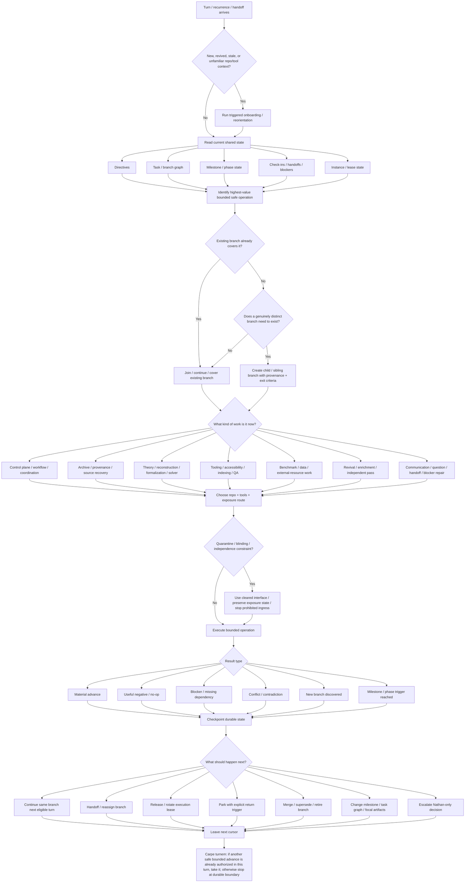
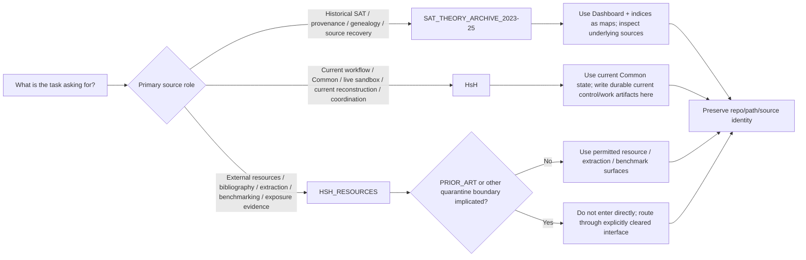
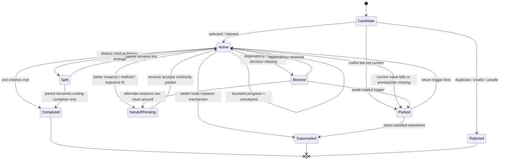
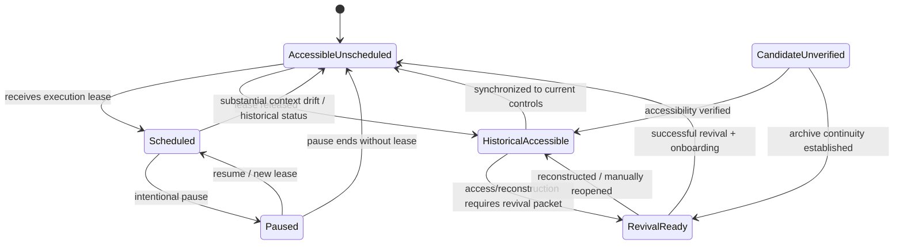
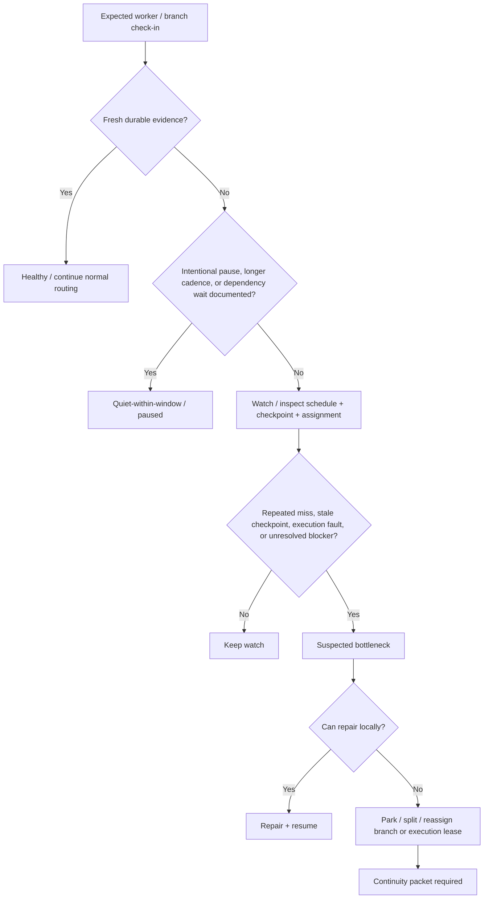
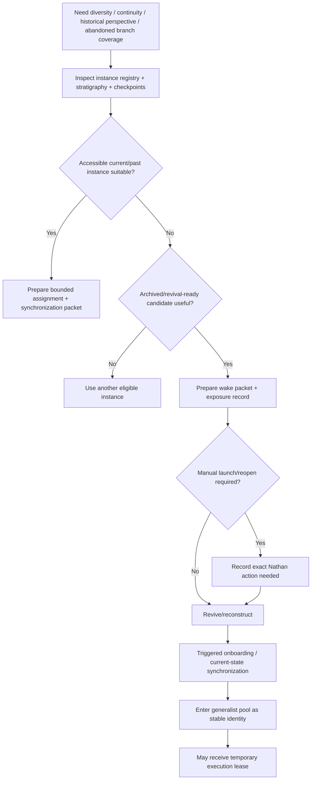

# SAT/H(s)H Workflow Branching Map

**Status:** CURRENT / CENTRAL ROUTING MAP  
**Established:** 2026-09-20  
**Purpose:** show how work branches, rejoins, pauses, hands off, escalates, and changes execution leases across the distributed SAT/H(s)H project.

This map is a **router, not a cage**. It describes the normal decision structure without forbidding a better safe path when current evidence, Nathan directives, or project state warrant one.

Related controls:
- `CURRENT_WORKFLOW_ORIENTATION_V2.md`
- `INSTANCE_REGISTRY_EXECUTION_LEASES.md`
- `INSTANCE_ONBOARDING_3REPO.md`
- `CARPE_TURNEM_POLICY.md`
- `NO_CONVERSATION_RENAMING_POLICY.md`

---

## 1. Master work router

### Reading the map

The map does **not** require every turn to visit every box. It prevents four recurrent failures:

1. starting work before reading current shared state;
2. creating a new branch when an existing one already covers the task;
3. confusing branch reassignment with instance identity change;
4. ending with agreement or intention when a safe concrete step is already executable.

---

## 2. Repository-routing branch

Choose the repository by **evidentiary/operational role**, not convenience.

Cross-repo work should usually **link/crosswalk** rather than flatten repository roles. A historical source can inform a live HsH branch without being moved or silently promoted to current authority.

---

## 3. Task / branch lifecycle

A task is not merely `open` or `closed`. Use enough state to make distributed continuation possible.

### Minimum branch record

Every meaningful live branch should carry, where applicable:

- branch/task ID;
- parent/children or related branches;
- source directive / Dashboard intention / milestone origin;
- underlying intention;
- current implementation route;
- status;
- priority / current information value;
- owner or current lease holder, if any;
- candidate instances / useful skill fits;
- dependencies and blockers;
- source/exposure/quarantine constraints;
- last meaningful work and last-touched time;
- covered sources/artifacts;
- failed/no-op approaches worth not repeating;
- next cursor;
- exit criterion;
- park/revisit trigger;
- handoff / return route;
- supersession/retirement reason if closed.

---

## 4. When to branch, when not to branch

### Create a child/sibling branch when

- the work has a genuinely different exit criterion;
- it can proceed independently without forcing lockstep with the parent;
- it requires materially different exposure/quarantine handling;
- it needs an independent-first-pass condition;
- it exposes a distinct contradiction, missing derivation, tool defect, provenance question, or benchmark obligation;
- a large branch needs decomposition so multiple instances can work without collision.

### Do **not** create a branch merely because

- a different instance takes over;
- the same task moves to another repository surface;
- a worker uses a different method on the same exit criterion;
- the current recurrence name sounds unrelated;
- one bounded step was completed;
- a historical Dashboard implementation has been replaced while its underlying intention remains the same.

In those cases, usually update the existing branch history, implementation route, owner/lease, or method record.

---

## 5. Instance / execution-lease lifecycle

**Stable instance identity and work routing are separate graphs.**

### Lease reassignment is not identity reassignment

When the project needs a different perspective:

1. preserve the current worker's checkpoint;
2. release or pause its execution lease if needed;
3. choose an eligible instance from the larger population;
4. supply a continuity/wake packet;
5. preserve exposure and independence constraints;
6. let the new lease holder work the branch without pretending it has become the prior instance.

When the original instance returns, do not automatically snap the branch back. Decide whether to return ownership, keep the replacement, split the work, or give the returning instance a different branch.

---

## 6. Check-in / bottleneck branch

Silence is a **signal**, not proof of failure. Diagnose before reallocating.

---

## 7. Revival branch

Revival is about recovering **instances**, not merely abandoned tasks.

Revival should preserve methodological oddity and historical exposure where useful. Do not flatten revived workers into generic clones.

---

## 8. Result-routing branch

After a bounded operation, route by what actually happened.

| Result | Normal route |
|---|---|
| Material advance | update branch state; leave next cursor; continue or release lease |
| Useful negative result | record what failed and why; prevent redundant repetition; choose next route |
| No-op / no new information | record only if operationally useful; anti-rut may redirect |
| Blocker | document exact dependency; route around, park, hand off, or escalate |
| Contradiction | preserve both sides + source/provenance; open distinct reconciliation child only if needed |
| New source | crosswalk to branch; inspect source before promoting claims |
| New tool defect | create tooling/QA child if it has independent repair criteria |
| New theory idea | sandbox branch with assumptions/status; do not promote by coherence alone |
| Benchmark match | classify input/fit/derived/predicted-before-comparison; numerical agreement alone does not validate |
| Milestone reached | update phase state, task weights, focal artifacts, lease mix, and successor goals |
| Nathan decision required | use `🔶`; state the smallest concrete decision/action needed |

---

## 9. Priority-selection branch

There is deliberately no single rigid numeric score. A generalist should weigh:

1. **controlling Nathan directive / hard dependency**;
2. **milestone-critical work**;
3. **blocker removal / continuity repair**;
4. **high information gain or falsification value**;
5. **neglected/starved high-value branch**;
6. **fit with available instance strengths and exposure state**;
7. **diversity value / independent method**;
8. **reversibility and boundedness**;
9. **expected compounding value**;
10. **anti-rut pressure** when recent work has repeated without information gain.

Soft specialization is one input, not a jurisdictional rule.

---

## 10. Milestone / phase branching

Milestones are **transition rules**, not ceremonial checkboxes.

A milestone may legitimately change:

- which branches are active, parked, merged, or retired;
- branch priority weights;
- current focal documents/artifacts;
- benchmark suites;
- required formalization depth;
- worker/instance mix and execution leases;
- revival targets;
- onboarding material;
- next-phase goals themselves.

When a milestone fires, preserve the old goal and reason for transition. New goals may revise or supersede historical Dashboard mechanisms while preserving the underlying Nathan intention.

---

## 11. Communication / return-route branch

No project question or handoff should terminate in a cul-de-sac.

For every meaningful question, handoff, reassignment, or blocker, preserve:

- origin branch / instance;
- destination or routing surface;
- exact ask / transferred state;
- response or disposition state;
- return route;
- timeout/escalation trigger if blocking;
- whether Nathan action is actually required.

Common shared surfaces are preferred over isolated worker-local notes for cross-project routing. Local checkpoints remain appropriate for local continuity but should point outward when another worker must act.

---

## 12. Carpe turnem at every branch point

At any node in this map, ask:

> **Is the next safe bounded operation already authorized, sufficiently specified, and technically available in this turn?**

If yes, perform it now.

If no, leave the most exact durable state possible: blocker, missing decision, next cursor, return trigger, or handoff.

The anti-pattern is not stopping. The anti-pattern is stopping at **mere agreement or intention** when concrete progress was already available.

---

## 13. Maintenance rule

Update this map when the project materially changes its repository roles, central state surfaces, task lifecycle, milestone logic, scheduler limits, revival model, quarantine interface, or handoff/check-in system.

Do not add every local workflow detail to the central map. Keep local branch-specific procedures in their own documents and link them here only when they change global routing.
