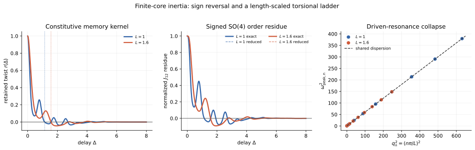

# Ravel sandbox — inertial torsion resonance

**Status:** `GEN/CANDIDATE`. This is a finite-core mechanics test, not canonical H(s)H and not empirical validation. Historical constants, lattice structure, particle labels, and archived claimed predictions were excluded.

## Result

Finite-core inertia earns a distinct testable role only if an oriented intersection observable exhibits **signed ringing** or a length-scaled resonance ladder. The minimal linear constitutive law is

\[
\mathcal I\,\partial_t^2X+\gamma\,\partial_tX
=C\,\partial_s^2X-KX+T(s,t),
\qquad X(s,t)\in\mathfrak{so}(4),
\]

on a finite worldtube segment (0\le s\le L). Its modal poles and driven peaks are

\[
s_n^\pm=
\frac{-\gamma\pm\sqrt{\gamma^2-4\mathcal I k_n}}{2\mathcal I},
\qquad
k_n=K+C\left(\frac{n\pi}{L}\right)^2,
\]

\[
\boxed{\omega_{{\rm peak},n}^2
=\frac K{\mathcal I}
+\frac C{\mathcal I}\left(\frac{n\pi}{L}\right)^2
-\frac{\gamma^2}{2\mathcal I^2}}.
\]

The second equation is the principal discriminator: measurements at different (L) must collapse onto one straight line in (q_n^2=(n\pi/L)^2), with shared slope (C/\mathcal I) and intercept (K/\mathcal I-\gamma^2/(2\mathcal I^2)).

## Reading and provenance record

### Controlling material

- `Satobloc/HsH/WORKSPACES/COMMON/NEW_INSTANCE_START_HERE.md` — refreshed completely.
- `WORKSPACES/COMMON/REFERENCE_DESK/README.md`, current workflow orientation/task graph, symbol-management and citation controls, toolbox namespace files, and `🔑/🔑.md` — reviewed before construction. The corrected single-metric-gradient/time-normal framing controls; no (H_0+c) or dual-shell machinery was used.
- HSH_RESOURCES was consulted only as routing and namespace support. No quarantined mechanism was imported.

### Historical SAT source

- [`Satobloc/SAT_THEORY_ARCHIVE_2023-25/2026/SAT THEORY — Worldlines.txt`](https://github.com/Satobloc/SAT_THEORY_ARCHIVE_2023-25/blob/main/2026/SAT%20THEORY%20%E2%80%94%20Worldlines.txt), blob `1c86774915c8ea9255798a07d06891afe0f23549` — read sequentially in full, 36,581 decoded characters. The file is malformed as one long physical line, so coverage is recorded by characters rather than line count. Retained only as `SRC/HISTORICAL`: its distinction between persistent coiled histories and localized torsional waves, plus the mechanical motifs of torsion gradients and elastic backsnap. Particle assignments, scale claims, lattice, fixed angles, masses, blackout claims, and generated confidence remain `SRC/QUARANTINED`.

### Current H(s)H source

- [`Satobloc/HsH/DEVELOPMENT_FULL_CONVOS/7OCT26_A_GRADE_MINEABLES/G5Backbone.txt`](https://github.com/Satobloc/HsH/blob/main/DEVELOPMENT_FULL_CONVOS/7OCT26_A_GRADE_MINEABLES/G5Backbone.txt), blob `911e3e1a55a54c9b338d05f474b2938bb76a1eef` — read completely, 8,333 decoded characters. It is a generated, highly overconfident synthesis. Retained only after the independent construction as a recovery lead for (SO(4)) angular variables and a kinetic-versus-stiffness variational structure. Its ontology, lattice, claimed closure, constants, mass calculus, particle assignments, and empirical claims remain `GEN/QUARANTINED`.

## Independent construction

### 1. Minimal finite-core action

At small angular displacement, use the tangent algebra of the transported frame. The conservative part is

\[
S_X=\frac12\int dt\int_0^Lds\,
\left[
\mathcal I\|\partial_tX\|^2
-C\|\partial_sX\|^2
-K\|X\|^2
\right],
\]

with Rayleigh dissipation

\[
\mathscr D=\frac\gamma2\int_0^L\|\partial_tX\|^2ds.
\]

This yields the constitutive PDE above with free-end conditions (\partial_sX|_{0,L}=0). It is a linearized material-frame model, not yet a full covariant worldtube action.

The Neumann modes are

\[
\phi_0=L^{-1/2},\qquad
\phi_n=\sqrt{2/L}\cos(n\pi s/L),
\]

and a collocated localized actuation/resolving surface gives nonnegative normalized weights

\[
w_n\propto \phi_n(s_0)^2e^{-(n\pi\sigma/L)^2}.
\]

For initial displacement (a_n(0)=1,\dot a_n(0)=0), an underdamped mode responds as

\[
a_n(t)=e^{-\alpha t}
\left[
\cos(\omega_{d,n}t)
+\frac{\alpha}{\omega_{d,n}}\sin(\omega_{d,n}t)
\right],
\]

where

\[
\alpha=\frac\gamma{2\mathcal I},\qquad
\omega_{d,n}^2=\frac{k_n}{\mathcal I}-\alpha^2.
\]

The total retained twist is (r(t)=\sum_nw_na_n(t)). Unlike the previous positive exponential mixture, (r) may change sign.

### 2. The observable must retain orientation

An unsigned holonomy angle erases the main inertial discriminator. For weak noncommuting perturbations

\[
A=e^{\varepsilon J_{01}},\qquad B=e^{\varepsilon J_{02}},
\]

I matched the two final transported time normals, subtracted the fully forgotten (r=0) residue, took the matrix logarithm, and projected it onto the oriented commutator generator (J_{12}):

\[
\chi_{12}=\frac12
\left\langle
\log(R_{AB}R_{BA}^{-1}R_0^{-1}),J_{12}
\right\rangle_F.
\]

The normalized small-perturbation result is

\[
\boxed{M_{12}(t)=2r(t)-r(t)^2+O(\varepsilon)}.
\]

If (r<0), the signed order residue reverses. Every collocated passive overdamped model of the previous form,

\[
r_{\rm OD}(t)=\sum_nw_ne^{-\lambda_nt},\qquad w_n\ge0,
\]

stays positive. A sign reversal therefore cannot be purchased merely by refitting its decay constants.

## Solver result

Dimensionless test values were

\[
\mathcal I=0.100,\quad\gamma=0.200,\quad C=0.060,\quad K=0.250,
\quad s_0=0.31L,\quad\sigma=0.07L,
\]

with 80 modes and (\varepsilon=0.04). These values test mathematical structure only.

| Segment | First kernel zero | First exact signed-SO(4) zero | Minimum (r) | Minimum signed residue | Max exact/reduced mismatch |
|---|---:|---:|---:|---:|---:|
| (L=1.0) | 1.144697 | 1.144695 | −0.03704 | −0.07629 | 0.001304 |
| (L=1.6) | 1.571081 | 1.571080 | −0.04459 | −0.09218 | 0.001304 |

Across both lengths, a direct fit of the driven peaks returned

\[
\omega_{\rm peak}^2=(0.500000000000003)
+(0.600000000000000)q^2,
\]

matching the independently specified intercept (0.5) and slope (C/\mathcal I=0.6) to floating-point precision. This exact collapse is a synthetic solver consistency check, not evidence from nature.

## SAT → H(s)H translation

The useful old SAT idea is not its particle census. It is the distinction between a persistent extended carrier and a localized twist-like excitation. In present language, the finite worldtube carries material-frame degrees of freedom; matter-induced rotation of the time normal perturbs those degrees of freedom; the resulting torsional disturbance propagates, damps, and is instantiated through an oriented intersection observable.

The smallest choice remains overdamped unless a calculation or observation requires inertia. Signed overshoot, ringdown, or the common dispersion line above would supply that requirement. Without one of those, (\mathcal I) is avoidable complexity and should be set aside.

## Experiment / solver discriminator

Two complementary tests use the same parameters:

1. **Delay test:** apply weak (J_{01}) and (J_{02}) perturbations in both orders. After matching final time normals, measure the oriented (J_{12}) coefficient rather than the magnitude. Scan the separation (\Delta). A reproducible sign reversal rules out every positive collocated overdamped mixture.
2. **Frequency test:** drive localized torsion sinusoidally. Repeat for several effective lengths. Extract resonance poles and regress (\omega_{{\rm peak},n}^2) against (q_n^2=(n\pi/L)^2). All lengths must share one slope and intercept.

Changing resolving width should change modal **weights**, not pole locations. Changing length should shift (n>0) poles through (L^{-2}), while the uniform-mode stiffness remains (K).

## Failure conditions

- No signed overshoot or resolvable resonance: inertia is not identified; retain the overdamped model.
- Peak locations fail a shared affine law in (q_n^2): reject this uniform finite-rod architecture.
- Resolver width moves the poles rather than only their weights: the apparent spectrum is likely acquisition geometry.
- Sign changes appear only after taking a matrix-log branch jump or only in an unsigned magnitude: reject the claimed inertial signal.
- Large perturbations destroy the (O(\varepsilon)) convergence of (M_{12}=2r-r^2): the linearized tangent-algebra model is outside its valid regime.
- Negative (\mathcal I,C,K) or (\gamma), or growing poles, violate the passive model assumed here.

## Next cursor

Replace the scalarized (X\in\mathfrak{so}(4)) modes by an explicitly transported material director frame (R(s,t)\in SO(4)). Determine whether the covariant derivative and frame connection split the six rotation planes into coupled resonance families, or whether the scalar modal law survives as the correct small-amplitude limit.

Durable artifacts:

- `WORKSPACES/RAVEL/SANDBOX_2026-10-07_INERTIAL_TORSION_RESONANCE.md`
- `WORKSPACES/RAVEL/CODE/inertial_torsion_resonance.py`
- `WORKSPACES/RAVEL/DATA/inertial_torsion_resonance.json`
- `WORKSPACES/RAVEL/FIGURES/inertial_torsion_resonance.svg`
