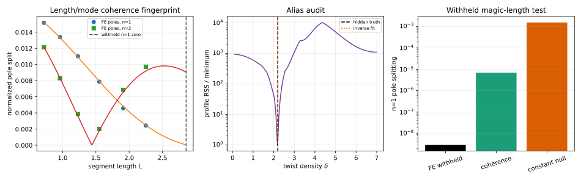

# Ravel sandbox — blind pre-twist inverse/discriminator

**Status:** `GEN/CANDIDATE`; noncanonical sandbox construction.  
**Class:** P (synthetic finite-element carrier + blind inverse fit).  
**Question:** can a finite-core spectrum recover hidden material pre-twist from several segment lengths, and can a detector-fixed anisotropy counterfeit it?

## Result in one sentence

A rotating anisotropic core leaves a length-and-mode coherence fingerprint in its **pole locations**; in a blind synthetic test, six training lengths and two modes recovered the hidden twist density to 0.78%, beat a generous constant-splitting null by ΔAIC = 80.24, and predicted a withheld coherence-zero length with 220× smaller absolute error than that null.

## Independent construction (before source cross-pollination)

Let a two-component material displacement `u(s)` live on an open finite segment `s∈[0,L]`.  The carrier operator is

\[
\mathcal L u=-\partial_s\!\left[C(s)\partial_s u\right],
\qquad
C(s)=R(\delta s)c_{\rm iso}
\begin{pmatrix}1+\varepsilon_C&0\\0&1-\varepsilon_C\end{pmatrix}
R(\delta s)^T,
\]

with natural/free endpoints.  Here `δ` is material-axis twist density, `ε_C` is dimensionless constitutive anisotropy, and `c_iso` has units of eigenvalue·length².  For the unperturbed Neumann mode `q_n=nπ/L`, first-order degenerate perturbation theory gives

\[
\bar\lambda_n=c_{\rm iso}q_n^2+O(\varepsilon_C^2),
\]

\[
\Delta\lambda_n
=2c_{\rm iso}q_n^2\varepsilon_C\,|F_n(\delta L)|
+O(\varepsilon_C^2),
\]

\[
F_n(x)=\frac{n^2\pi^2\sin x}{x(n^2\pi^2-x^2)},
\quad F_n(0)=1,
\quad F_n(n\pi)=\tfrac12.
\]

The non-resonant zeros `x=mπ`, `m≠0,n`, are the discriminator.  For `n=1`, `δL=2π` suppresses the leading split although both pre-twist and anisotropy remain nonzero.

### What is identifiable

The common-mode ladder identifies `c_iso` from `\bar λ_n/q_n²`.  Conditional on that calibration, multi-length/multi-mode splitting identifies `(δ,ε_C)` when the profile likelihood has an isolated minimum.  Splitting alone identifies only the product `c_iso ε_C` plus `δ`; it cannot separate stiffness scale from anisotropy.  This is a structural degeneracy, not a numerical inconvenience.

### Readout/null separation

A detector or resolving tensor can change mode **weights**, visibility, and polarization labels.  It cannot move the generalized-eigenvalue poles of the carrier.  Therefore:

- strict detector-fixed null: zero induced pole splitting;
- deliberately generous nuisance null: a length-independent normalized split, representing a boundary anisotropy or peak-fitting bias rather than a pure readout tensor.

This distinction prevents a readout effect from being silently promoted into carrier dynamics.

## Blind finite-element test

The generator used hidden values

\[
(c_{\rm iso},\varepsilon_C,\delta)=(0.06,0.018,2.2),
\]

120 linear elements, relative pole noise `2×10⁻⁴`, training lengths
`{0.72,0.96,1.23,1.55,1.91,2.25}`, and modes `n={1,2}`.  The inverse received only unordered noisy pole pairs.

| Quantity | Hidden | Recovered |
|---|---:|---:|
| `c_iso` | 0.060000 | 0.0600076 |
| `δ` | 2.200000 | 2.18290 |
| `ε_C` | 0.018000 | 0.0179080 |

The coherence model had RSS `1.294×10⁻⁶`; the constant-normalized-splitting null had RSS `1.225×10⁻³`.  With the appropriate parameter count, `ΔAIC = AIC_null − AIC_coherence = 80.24`.

The withheld length was fixed from the hidden condition, not chosen after the fit:

\[
L_\star=\frac{2\pi}{\delta_{\rm true}}=2.8559933.
\]

At `L★`, the FE carrier gave `Δλ₁=2.94×10⁻⁹`.  The inverse coherence model predicted `6.93×10⁻⁶`; the generous null predicted `1.527×10⁻³`.  The coherence prediction is not exact because a 0.78% error in `δ` moves the estimated zero, but its absolute error is 220.3× smaller than the null's.  The next-best twist-density profile minimum had 1092× the best RSS, so the recovered basin was isolated over the scanned range `0.1≤δ≤7`.

## Source facts read after construction

### Archive source

**Path:** `Satobloc/SAT_THEORY_ARCHIVE_2023-25/2026/SAT CORE — Donut canon.txt`  
**Coverage:** complete sequential read, beginning to end, 18,106-byte repository object.  
**Source facts used:** the document corrects a pointwise frame-difference construction to path-ordered transport under a non-flat connection; defines a relative group element `H_R^{-1}H_Q`; and explicitly separates closure of the projected/output curve from closure of the lifted configuration. It also contains incompatible developmental variants, so only the shared transport/closure distinctions are retained. ⟦SRC:DONUT·complete⟧

**Additional archive control read:** `Satobloc/SAT_THEORY_ARCHIVE_2023-25/2026/SAT AUDIT — Formal rules .txt`, complete sequential read, 4,108-byte repository object. It requires definitions before use, explicit ambiguity, one-to-one constraint translation, boundary conditions, and consistency checks. ⟦SRC:FORMALRULES·complete⟧

### H(s)H source

**Path:** `Satobloc/HsH/DEVELOPMENT_FULL_CONVOS/30SEP26_DUMP/2026-09-26_RUN_136_CROSSOVER_INVERSE_MAP_IDENTIFIABILITY.md`  
**Coverage:** complete sequential read, beginning to end, 5,668-byte repository object.  
**Source facts used:** within its separate quadratic-contact model, it gives an explicit inverse map and then states the exact remaining degeneracy: only `ρ_eff=ρ_n+h` is identifiable from the stated observables, not `ρ_n` and `h` separately. It also separates signed and magnitude-only coordinates. ⟦SRC:RUN136·complete⟧

### Routing/resources

The controlling front door, Reference Desk, required onboarding/symbol/citation/toolbox/current-orientation surfaces, HSH_RESOURCES root index, toolkit index/digestion plan, Tool Chest, Nathan preference router, and War Room declaration were overview-read before theory work. HSH_RESOURCES served only as routing/tool familiarity; no external theory result was imported. The narrow Mersearch request `2026-10-07-ravel-anisotropic-core-spectrum-002` was present in `WORKSPACES/COMMON/MERSEARCH_REQUEST.json`, but its expected result directory was still absent; no result was presumed.

## Translation into current H(s)H language

**Source-grounded inference:** the archive transport/closure distinction suggests that an H(s)H particle candidate should not be identified with a single instantaneous resolved curve. The relevant carrier is the finite-core history with transported material structure; the resolver supplies weights and local instantiation, while closure may belong only to the resolved trace. This is compatible with, but not derived by, the archive Donut construction.

**New sandbox conjecture:** a finite-core worldtube with matter-induced rotation/torsion of its time normal should carry a constitutive director frame. If that frame is anisotropic, accumulated rotation is observable through a coherence-filtered pole split even when uniform pre-twist would be gauge-removable in an isotropic core. In this candidate, a particle-like identity is a stable spectral/transport family across several resolved lengths, not one shape at one intersection.

**Smallest mechanics:** one finite core, one transported two-axis constitutive tensor, ordinary elastic eigenmodes, and a readout that measures pole locations and modal weights separately. No lattice, historical particle label, or fitted historical constant is used.

## Failure conditions

Reject or demote this mechanism if any of the following occurs:

1. The `δ` profile has comparably good alias minima over the admissible range.
2. Pole splitting is unchanged under controlled length variation after `q_n²` normalization.
3. A detector rotation moves pole locations rather than only their weights—this would reveal an unmodeled carrier/boundary coupling or a fitting artifact.
4. The predicted non-resonant coherence zero is absent beyond declared FE, noise, and `O(ε_C²)` remainder.
5. A full covariant finite-worldtube model cannot supply a positive constitutive energy or transports the director frame inconsistently.

## Tight next test

Use a single physical or high-fidelity simulated carrier whose length can be varied while its material twist density is held fixed. Measure both polarization-resolved pole positions and detector weights for at least six lengths and two modes. Fit on all but a preregistered candidate magic length; rotate the detector at fixed carrier geometry; then test simultaneously:

- poles follow `q_n²|F_n(δL)|` and survive detector rotation;
- weights change under detector rotation;
- the withheld pole split collapses near `δL=mπ`, `m≠n`.

That three-part pattern distinguishes carrier pre-twist from detector anisotropy and from a length-independent boundary split.

## Artifacts

- `WORKSPACES/RAVEL/CODE/pretwist_inverse_discriminator.py`
- `WORKSPACES/RAVEL/DATA/pretwist_inverse_discriminator.json`
- `WORKSPACES/RAVEL/FIGURES/pretwist_inverse_discriminator.svg`

No claim here is canonical SAT/H(s)H theory or empirical validation.
