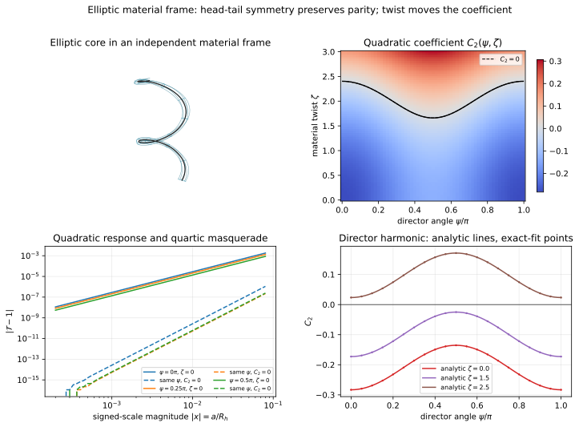

# Ravel sandbox — elliptic material-frame torque

**Status:** GEN/CANDIDATE; standard tube geometry plus a proposed H(s)H discriminator  
**Maturity:** analytic expansion checked against exact numerical quadrature

## Result

A head–tail-symmetric elliptical core transported around a helix remains exactly even in signed core scale under complete or antipodally paired contact. Ellipticity does not create a linear correction by itself.

It creates two quadratic effects:

1. a director harmonic proportional to \(\cos 2\psi_m\);
2. a positive surface-stretch term proportional to the square of material twist.

Those terms can cancel the ordinary quadratic coefficient. At the cancellation point, exact parity forces the response to begin at fourth order. A useful experiment must therefore scan director angle and material twist rather than fit one geometry.

## Fresh source record

### [[GLASS]] old archive

- Path: Satobloc/SAT_THEORY_ARCHIVE_2023-25/H(s)H MATH TO DO.txt
- Coverage: contiguous lines 1–1400 requested and substantially read.
- Material encountered: the tool plan; the invariants_py discussion; the decomposition “invariant field → moving-frame dynamics → embedded trajectory”; curvature/torsion reconstruction; and the warning that the referenced package is a three-dimensional solver chassis that does not supply worldtube cross-sections or a physical action.
- Use here: motivation for separately propagating the moving frame and explicitly constructing the cross-section.
- Not imported: the package, its optimizer, its proposed four-dimensional extension, or any claim that solver cost is physical action.

### [[HsH]] September 30 material

- Path: Satobloc/HsH/DEVELOPMENT_FULL_CONVOS/30SEP26_DUMP/STATE OF SAT.txt
- Coverage: contiguous lines 1–1400 requested and substantially read.
- Material encountered: an assistant-generated proposal treating \(\psi\) as an angular/phase variable with closed-loop holonomy and twist sectors, followed by speculative particle and field identifications.
- Use here: only the recoverable idea that an angular variable can be transported independently along a filament.
- Not imported: archive angle meanings, particle labels, mass rules, discrete fusion rules, Dirac equivalence, or claims that winding already supplies spin statistics.

The Common front door and task-relevant controls were re-read first. Mersearch request 2026-10-08-ravel-elliptic-material-frame-001 was then posted. Its result manifest was not present during this run, so bounded repository retrieval was used. Quarantined prior art was not opened.

## Provenance boundary

**Source facts (SRC/HISTORICAL or SRC/CANDIDATE):** the archive contains an invariant-to-frame-to-embedding program; the September 30 source proposes an independently transported angular variable.

**Standard geometry (STD/DERIVED here):** the swept surface and Jacobian follow from an elliptic cross-section transported by an orthonormal material frame.

**New conjecture (GEN/CANDIDATE):** if an H(s)H finite core deposits traction through such a surface, its torque should expose the derived director and twist harmonics.

This represents a possible finite-core history and interaction map. The parametrization is not identified with the modeled object itself.

## Material-frame geometry

Let the helix centerline carry Frenet frame \((\mathbf t,\mathbf n,\mathbf b)\), curvature \(\kappa_h\), and torsion \(\tau_h\). Define material directors by an independent angle \(\psi_m(s)\):

\[
\mathbf d_1=\cos\psi_m\,\mathbf n+\sin\psi_m\,\mathbf b,
\qquad
\mathbf d_2=-\sin\psi_m\,\mathbf n+\cos\psi_m\,\mathbf b.
\]

The material-frame spin about the centerline is

\[
\boxed{\Omega_m=\tau_h+\psi_m'(s).}
\]

Thus Frenet locking gives \(\Omega_m=\tau_h\); rotation-minimizing transport gives \(\Omega_m=0\); active material twist permits arbitrary \(\Omega_m\).

With semiaxes \(a,b\),

\[
\mathbf X(s,\varphi)
=\mathbf c(s)+a\cos\varphi\,\mathbf d_1+b\sin\varphi\,\mathbf d_2,
\]

\[
\mathbf d_1'=-\kappa_h\cos\psi_m\,\mathbf t+\Omega_m\mathbf d_2,
\qquad
\mathbf d_2'=+\kappa_h\sin\psi_m\,\mathbf t-\Omega_m\mathbf d_1.
\]

Writing

\[
h=a\cos\varphi\cos\psi_m-b\sin\varphi\sin\psi_m,
\]

direct evaluation of \(J=|\partial_s\mathbf X\times\partial_\varphi\mathbf X|\) gives

\[
\boxed{
J^2
=(1-\kappa_h h)^2
(a^2\sin^2\varphi+b^2\cos^2\varphi)
+\Omega_m^2(a^2-b^2)^2\sin^2\varphi\cos^2\varphi.
}
\]

The last term is material-twist stretching. It vanishes when \(a=b\), because rotating a circle about its centerline changes no surface geometry.

## Dimensionless form

Set

\[
x=\frac a{R_h},\quad
\lambda=\frac ba,\quad
q=\frac{R_h^2}{R_h^2+p_h^2},\quad
\zeta_m=R_h\Omega_m.
\]

Define

\[
H=\cos\varphi\cos\psi_m-\lambda\sin\varphi\sin\psi_m,
\]

\[
K=\cos\varphi\sin\psi_m+\lambda\sin\varphi\cos\psi_m,
\]

\[
E=\sin^2\varphi+\lambda^2\cos^2\varphi,\qquad
D=\frac{(1-\lambda^2)^2\sin^2\varphi\cos^2\varphi}{E}.
\]

The axis distance and relative Jacobian are exactly

\[
\frac{\rho}{R_h}
=\sqrt{(1-xH)^2+(1-q)x^2K^2},
\]

\[
\frac{J}{a\sqrt E}
=\sqrt{(1-qxH)^2+\zeta_m^2x^2D}.
\]

## Torque expansion

Let \(g(\rho)=\rho f(\rho)\) be the axial moment density and define

\[
\alpha_g=\frac{R_hg'_h}{g_h}
=1+\frac{R_hf'_h}{f_h},
\qquad
\beta_g=\frac{R_h^2g''_h}{g_h}
=2\frac{R_hf'_h}{f_h}+\frac{R_h^2f''_h}{f_h}.
\]

Let \(\langle\cdot\rangle_E\) be an angular average weighted by the baseline ellipse perimeter element \(\sqrt E\,d\varphi\), including any contact mask. Total torque per centerline length at fixed traction density obeys

\[
\boxed{
\begin{aligned}
\mathcal T
={}&1-(q+\alpha_g)\langle H\rangle_E x\\
&+\left[
\frac{\alpha_g(1-q)}2\langle K^2\rangle_E
+\left(\frac{\beta_g}{2}+q\alpha_g\right)\langle H^2\rangle_E
+\frac{\zeta_m^2}{2}\langle D\rangle_E
\right]x^2
+O(x^3).
\end{aligned}
}
\]

## Exact parity theorem

Under \(x\to-x\), the substitution \(\varphi\to\varphi+\pi\) sends \(H,K\to-H,-K\) while leaving \(E,D\) unchanged. Therefore complete or antipodally paired contact satisfies

\[
\boxed{\mathcal T(x)=\mathcal T(-x).}
\]

All odd powers vanish exactly for any ellipse orientation and material twist. A dipolar contact mask can violate this condition; a quadrupolar, head–tail-symmetric mask cannot.

## Director and twist discriminator

For complete uniform loading define

\[
M_c=\langle\cos^2\varphi\rangle_E,\qquad
M_s=\langle\lambda^2\sin^2\varphi\rangle_E,
\]

\[
M_\pm=\frac{M_c\pm M_s}{2},\qquad D_E=\langle D\rangle_E.
\]

Then

\[
\boxed{
\begin{aligned}
C_2(\psi_m,\zeta_m)
={}&\frac{M_+}{2}[\beta_g+\alpha_g(1+q)]\\
&+\frac{M_-}{2}
[\beta_g-\alpha_g+3q\alpha_g]\cos2\psi_m
+\frac{D_E}{2}\zeta_m^2.
\end{aligned}
}
\]

Hence:

1. director rotation produces only a \(\cos2\psi_m\) harmonic at this order;
2. passive geometric twist is even in \(\Omega_m\) and quadratic in magnitude;
3. \(\lambda\to1\) kills both director and twist-stretch dependence, recovering the circular result.

If \(C_2(\psi_m,0)<0\), the quadratic term vanishes at

\[
\boxed{
\zeta_{m,*}(\psi_m)
=\sqrt{\frac{-2C_2(\psi_m,0)}{D_E}}.
}
\]

Exact parity then forces \(\mathcal T-1=O(x^4)\). This is a paired-contact “quartic masquerade,” complementary to the one-sided pitch null from the preceding build.

## Numerical check

The solver used arbitrary, unfitted values

\[
\lambda=0.55,\qquad q=0.60,\qquad
\frac{f(\rho)}{f(R_h)}=e^{-1.3(\rho/R_h-1)}.
\]

Exact quadrature produced:

- maximum analytic-versus-fitted \(C_2\) error: \(1.42\times10^{-9}\);
- maximum evenness error: \(3.33\times10^{-16}\);
- ordinary small-\(x\) exponent: \(1.999999\);
- null exponents: \(4.0026\), \(4.0034\), and \(3.9999\) for \(\psi_m=0,\pi/4,\pi/2\);
- corresponding dimensionless null twists: \(2.40293\), \(2.06559\), and \(1.66110\).

These verify the algebra and identifiability, not the proposed physical coupling.

Assets:

- CODE/elliptic_material_frame_torque.py
- DATA/elliptic_material_frame_torque.json
- FIGURES/elliptic_material_frame_torque.svg

## Proposed apparatus

Use matched helical sleeves with fixed \(R_h\), pitch, semiaxes, and independently measured radial traction profile. Rotate the ellipse through \(\psi_m\) while controlling end-to-end material twist. Compare complete annular loading, two antipodal pads, and one pad as a deliberate parity-breaking control.

Fit

\[
C_2=A_0+A_2\cos2\psi_m+B_2\zeta_m^2.
\]

Use the fitted zero contour to preregister a quartic small-core response. Reversing twist must leave the geometric term unchanged. A sign-odd response requires another chiral traction law or apparatus asymmetry.

Normalization must be declared. These equations assume fixed traction density and total torque per centerline length. Fixing total applied force changes the area-stretch term.

## Failure conditions

Reject or revise this mechanism if:

1. paired, head–tail-symmetric loading yields a reproducible linear term;
2. director dependence contains a first harmonic without a measured dipolar asymmetry;
3. passive geometry is odd under \(\Omega_m\to-\Omega_m\);
4. \(C_2\) is not affine in \(\zeta_m^2\) in the small-core regime;
5. a preregistered coefficient null does not change scaling from quadratic to quartic;
6. the circular limit retains director or twist-stretch dependence;
7. local coordinates lose injectivity, the ellipse self-contacts, or a global reach constraint fails;
8. director variation, traction anisotropy, elasticity, or stick–slip dominates but is not modeled.

Ordinary elasticity and apparatus couplings are competing mechanisms to measure, not reasons to discard the apparatus.

## Durable next cursor

Promote \(\psi_m(s)\) to a dynamical elastic-rod field with bending and twist energy. Couple its Euler–Lagrange equation to the traction functional and test whether the torque-null contour is stable, bifurcates, or becomes hysteretic under imposed end rotation.
