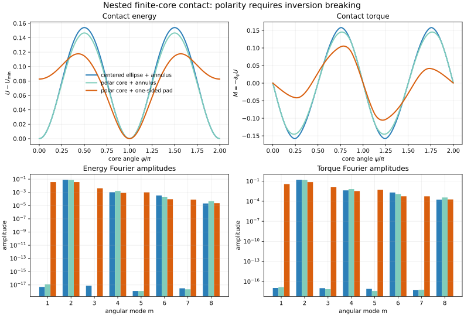

# Ravel sandbox checkpoint — nested contact polarity

**Status:** siloed conjecture and mechanics test; not canonical H(s)H.  
**Question:** can an explicit nested elliptic sleeve generate the localized `1 + cos(psi)` pin used in the preceding director-field build?

## Result in one sentence

No centered elliptic core inside an inversion-symmetric annular sleeve can distinguish `psi` from `psi + pi`; the previous first-harmonic pin therefore requires a genuine polar marker **and** inversion-breaking contact, not ellipticity alone.

## Source record

### Controlling HsH material

- `WORKSPACES/COMMON/NEW_INSTANCE_START_HERE.md` — read in full; followed its reference-desk, workflow, symbol-management, citation, and Mersearch routing.
- `WORKSPACES/COMMON/REFERENCE_DESK/README.md` — read in full.
- `WORKSPACES/COMMON/CURRENT_WORKFLOW_ORIENTATION_V2.md` — read in full.
- `WORKSPACES/COMMON/NONNEGOTIABLE_SYMBOL_MANAGEMENT.md` — read in full.
- `WORKSPACES/COMMON/terminology/SYMBOL_REGISTRY.md` — read in full.
- `WORKSPACES/COMMON/CITATION_AS_DEFAULT_POLICY.md` — read in full.

### Fresh archive source

- `Satobloc/SAT_THEORY_ARCHIVE_2023-25/Misc HsH-SAT/NESTED HOLONOMIES.txt`
- Coverage: contiguous lines 1–500 plus the exact search-returned passage containing “interbraid contact / worldtube pressure / braid-order locking / strand-on-strand forcing.”
- What was actually read: the June 2026 nested-holonomy discussion; its transport/memory framing; the move from static objects toward transformations; and the later proposal to replace vague “coupling” with specific finite-contact language.
- Provenance caution: mixed Nathan/assistant conversation, speculative and chronologically late. It is an idea quarry, not authority.

### Fresh HsH source

- `Satobloc/HsH/DEVELOPMENT_FULL_CONVOS/30SEP26_DUMP/[[[HSH REFORMULATION - INIT]]]/H(SAT)H - init/HsH Classic Run.txt`
- Coverage: contiguous lines 1–500, plus the search-returned contact-boundary excerpt.
- What was actually read: the initial audit posture, recursive-filament claims, frame/connection discussion, and Nathan's explicit rejection of unfixed constants, lattice crutches, catchphrases, and correction factors inserted merely to repair desired numbers.
- Use here: methodological constraint only—derive the contact term from the declared geometry and reject it if symmetry forbids it.

### Search routing

- Wrote `WORKSPACES/COMMON/MERSEARCH_REQUEST.json` with request ID `2026-10-08-ravel-nested-elliptic-contact-001` (commit `5506451434247b33eac6ac8df8a2fcb0cbe85337`).
- The expected manifest was not yet present when checked. A bounded GitHub corpus search supplied the two sources above; no generic internet search was substituted.

### HSH_RESOURCES routing/prior-art check (after the independent construction)

Read: `!_HSH_RESOURCES_INDEX.md`, `indexes/ai_source_index/HSH_TOOLKIT.md`, `info/TOOLKIT_DIGESTION.md`, `HQ/TOOL_CHEST.md`, `info/NATHAN_PREFERENCES/BOOT.md`, and `HQ/THE_WAR_ROOM/DECLARATION.txt`, including the linked-resource inventory in the declaration. These were used as tool/source routing and quarantine guidance only. A bounded toolkit search for Winkler/contact/sleeve terms returned no direct hit, so no external formalism was promoted into the construction.

## Source fact, inference, and conjecture

**Source facts.** The archive proposes nested transport/memory and names worldtube pressure/contact as candidate concrete relations. The September-30 conversation explicitly demands that a term be forced by geometry rather than added as a narrative repair.

**Inference.** If an H(s)H finite core is represented by an elliptic cross-section, its major-axis orientation is a head-tail-symmetric director. The angles `psi` and `psi + pi` describe the same centered ellipse.

**New sandbox conjecture.** A physically distinct `2 pi` material phase can arise from nesting only when the core carries a polar marker (eccentric satellite, seam, off-axis subcore, or equivalent) and the contacting environment breaks inversion symmetry (one-sided pad, asymmetric aperture, or equivalent). Ellipticity by itself supplies only nematic, `pi`-periodic anchoring.

## Minimal contact mechanics

Use circumferential angle `phi`, core material angle `psi`, and a dimensionless local compression field

\[
q(\phi;\psi)=d+u\cos 2\phi-v\cos 2(\phi-\psi)+e\cos(\phi-\psi).
\]

Here `d` is preload, `u` and `v` are sleeve/core quadrupoles, and `e` is a polar offset carried by the nested core. With unilateral Winkler contact and contact mask `w(phi)`,

\[
U_c(\psi)=\frac{k_c}{2}\int_0^{2\pi}w(\phi)\,[q(\phi;\psi)]_+^2\,d\phi,
\qquad [x]_+=\max(x,0).
\]

This is a deliberately minimal normal-contact law; it supplies a falsifiable symmetry statement before detailed elasticity is attempted.

### Symmetry theorem

If the environment is inversion symmetric,

\[
w(\phi+\pi)=w(\phi),
\]

then the change of variable `phi -> phi + pi` gives

\[
U_c(\psi+\pi)=U_c(\psi)
\]

for a centered ellipse (`e=0`) pointwise, and also for a polar-offset core inside a complete annulus after integration. The positive-part nonlinearity does not alter the conclusion. Consequently all odd angular Fourier modes vanish and no conservative `cos(psi)` pin exists.

For complete contact in a full annulus, orthogonality gives explicitly

\[
U_c(\psi)=\pi k_c\left[d^2+\frac{u^2+v^2+e^2}{2}-uv\cos 2\psi\right],
\]

\[
M_c(\psi)=-\partial_\psi U_c=-2\pi k_cuv\sin 2\psi.
\]

The torque repeats after `pi`, not `2 pi`.

If both `e != 0` and `w(phi + pi) != w(phi)`, the effective potential may contain

\[
U_c(\psi)=U_0+A_1\cos\psi+A_2\cos 2\psi+\cdots.
\]

That first harmonic is the mechanically admissible replacement for the previously inserted phenomenological pin.

## Numerical discriminator

The solver `WORKSPACES/RAVEL/CODE/nested_contact_polarity.py` used 8,192 circumferential points and 1,440 material angles with

`d=0.22, u=0.14, v=0.18, e=0.10`.

| Contact geometry | max `|U(psi+pi)-U(psi)|` | odd/even energy spectrum | `U(pi)-U(0)` |
|---|---:|---:|---:|
| centered ellipse + annulus | `1.67e-16` | `1.23e-16` | `0` |
| polar core + annulus | `1.94e-16` | `1.70e-16` | `0` |
| polar core + one-sided pad | `8.2667e-2` | `1.00155` | `-8.2667e-2` |

For the one-sided pad, the leading energy coefficients were `A1=0.0363965` and `A2=-0.0365722`. The odd part is therefore not a small correction; it is comparable to the nematic term in this deliberately visible test case.

## Translation into current H(s)H language

Conditional on a finite-core worldtube representation, replace the hand-inserted pin in the director functional by the contact-derived potential:

\[
E[\psi]=\int_0^L\left[
\frac{C}{2}(\partial_s\psi-\tau_0)^2
+g(s)U_c(\psi-\chi)
\right]ds.
\]

- `psi(s)` is a material-frame angle, not the centerline and not a particle label.
- `g(s)` localizes the actual contact region; it is not itself a fitted angular potential.
- `chi` is the orientation of the sleeve/pad geometry.
- A symmetric annulus yields only even harmonics and identifies `psi` with `psi+pi` at the level of elliptic morphology.
- A polar nested substructure plus asymmetric contact yields odd harmonics and makes the two orientations physically distinct.

This corrects the interpretation of the preceding phase-slip build: its stabilized `0 -> pi -> 0` profile is not yet evidence for elliptic-core memory. It is a valid polar-director model only if a polarity-bearing nested structure is supplied.

## Failure conditions

1. **Symmetry failure:** a converged, exact, frictionless annular calculation with a truly inversion-symmetric geometry produces a persistent odd harmonic. Then either the stated symmetry is absent or the model/solver is wrong.
2. **Morphology failure:** no durable polar marker exists in the proposed finite core. Then `psi` and `psi+pi` are physically identical and the earlier memory state is gauge/director redundancy.
3. **Contact failure:** the contact region is effectively antipodal or annular. Then the first harmonic averages away even if the core is polar.
4. **Constitutive failure:** measured torque is dominated by frictional history, adhesion, or plasticity rather than a reversible contact potential. Then this conservative `U_c` is insufficient.
5. **Averaging failure:** the polar marker precesses rapidly within the readout/contact time, suppressing the odd harmonic after coarse-graining.

## Tight experiment

Rotate the same nested core quasistatically through `0 <= psi < 2 pi` in three interchangeable sleeves: complete annulus, two antipodal pads, and one pad. Measure torque on forward and reverse sweeps and Fourier analyze it.

Define the odd-sector observable

\[
D(\psi)=M(\psi)-M(\psi+\pi).
\]

- Symmetric annulus and antipodal pads predict `D(psi)=0` within errors.
- A polar core under one-sided contact predicts a repeatable nonzero `D`, led by a `sin(psi-chi)` component.
- Large forward/reverse disagreement diagnoses frictional hysteresis rather than a conservative nesting potential.

This test distinguishes polar nesting from ordinary elliptic anisotropy without targeting any historical constant or particle label.

## Next cursor

Replace the Gaussian pin in the dynamic director solver with the tabulated contact potential from this calculation. Continue the loading cycle only for the one-sided polar architecture; use the annular case as a null control. The survival question becomes quantitative: what minimum measured odd-harmonic coefficient is required for a stable localized `2 pi` material-phase branch after friction and thermal noise are added?

