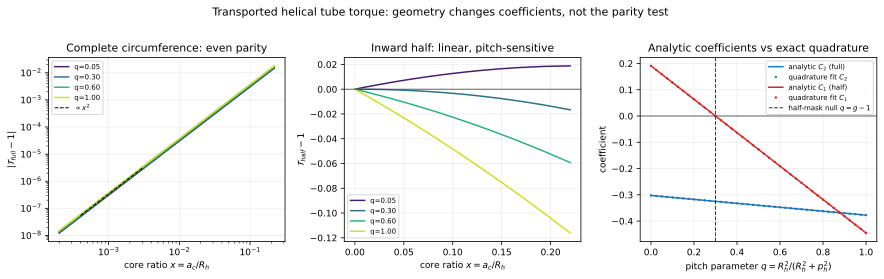

# Ravel sandbox — transported helical-tube torque

**Status:** SANDBOXED / proposed finite-core mechanics  
**Maturity:** analytic geometry plus numerical quadrature check; no particle identification  
**Question:** If SAT is a mostly standard-physics four-dimensional map, what changes when an H(s)H finite core is transported around an actual helix rather than represented by a zero-radius centerline?

## Result

For a circular core of radius (a_c) transported in the Frenet normal plane of a helical centerline, the exact surface measure supplies a curvature factor. A complete or antipodally paired circumference still cancels every odd finite-radius correction. A one-sided contact does not. The quadratic coefficient for the paired case and the linear coefficient for the one-sided case both depend on helix pitch.

The useful discriminator is therefore not merely “linear versus quadratic.” It is:

1. complete/paired contact: an even response whose (x^2) coefficient moves with pitch;
2. one-sided contact: a generically linear response whose sign can cross through zero at a calculable pitch;
3. at that zero, the one-sided response temporarily masquerades as quadratic, so parity alone is insufficient without a pitch scan.

Here (x=a_c/R_h) is the core-to-helix radius ratio. None of the numerical values below is imported from a historical particle fit.

## Source record

### `[[GLASS]]` old archive, substantially read

- Repository/path: `Satobloc/SAT_THEORY_ARCHIVE_2023-25/HsH COSMOTOPOLOGY.txt`
- Coverage: contiguous lines 1–1200 requested and read; the returned material included the torus construction, torus/Klein comparison, reconnection discussion, and the start of the linked-ring/figure-eight topology analysis.
- Source fact used: it writes the standard torus embedding
  
  \[
  X(u,v)=((R+r\cos v)\cos u,(R+r\cos v)\sin u,r\sin v),
  \]
  
  and identifies the inner longitude (v=\pi) as the locus met once by every fixed-(u) meridian.
- Source fact not promoted: CTC, Kerr, cosmological, exclusion, particle-zoo, and black-hole identifications remain historical conjectural framing and are not premises of the mechanics derived here.

### `[[HsH]]` current repository, read complete

- Repository/path: `Satobloc/HsH/DEVELOPMENT_FULL_CONVOS/30SEP26_DUMP/2026-09-26_RUN_133_CURVATURE_FREE_B2_RADIUS_RECONSTRUCTION.md`
- Coverage: complete file, lines 1–end.
- Source fact used: within its frozen local quadratic-contact model it reconstructs a rank-two carrier radius by
  
  \[
  \varepsilon\sim\frac{A_\Sigma}{2C_4\ell_\parallel},
  \]
  
  and separately imposes the admissibility gate (K\ell_\parallel^2\le 8\varepsilon).
- Source fact not promoted: the support type is not assumed to be physical. The formula is used only as motivation to keep core radius independently observable and to state an explicit admissibility gate.

### Retrieval route

- The current Common front door and its task-relevant pointers were read before theory work.
- A Mersearch request was posted as `2026-10-08-ravel-transported-helical-tube-001`. No matching response was available during this run, so a bounded GitHub fallback located exact files. Quarantined prior art was not opened.

## Translation into current H(s)H language

The old torus picture contains two clean geometric ingredients that survive without its cosmological claims:

- a distinguished closed centerline;
- a family of transverse core circles transported around it.

In current language, the minimal object is a finite tubular neighborhood of a closed or locally helical worldtube centerline. Observable interaction is a surface integral over that finite core, not a point evaluation on the centerline. The current radius-reconstruction result says that (a_c) should, in principle, be inferred from independent area/span data rather than tuned to a historical label.

This is a representation of a finite-core history and its readout, not an assertion that the drawn tube is itself a complete particle ontology.

## Exact helical tube geometry

Use helix angle (	heta):

\[
\mathbf c(\theta)=R_h\mathbf e_r(\theta)+p_h\theta\mathbf e_z,
\qquad
L_h=\sqrt{R_h^2+p_h^2}.
\]

Its Frenet data are

\[
\mathbf t=\frac{R_h\mathbf e_\phi+p_h\mathbf e_z}{L_h},
\quad
\mathbf n=-\mathbf e_r,
\quad
\mathbf b=\frac{R_h\mathbf e_z-p_h\mathbf e_\phi}{L_h},
\]

\[
\kappa_h=\frac{R_h}{L_h^2},
\qquad
\tau_h=\frac{p_h}{L_h^2}.
\]

Transport a circular core in the normal plane:

\[
\mathbf X(s,\varphi)=\mathbf c(s)+a_c(\cos\varphi\,\mathbf n+\sin\varphi\,\mathbf b).
\]

The exact tube area element is

\[
dS=a_c(1-a_c\kappa_h\cos\varphi)\,d\varphi\,ds.
\]

Define

\[
x=\frac{a_c}{R_h},
\qquad
q=\frac{R_h^2}{R_h^2+p_h^2},
\qquad 0\le q\le1.
\]

Then (a_c\kappa_h=qx), and the distance of a tube point from the bundle axis is

\[
\frac{\rho}{R_h}
=
\sqrt{(1-x\cos\varphi)^2+(1-q)x^2\sin^2\varphi}.
\]

The regular local tube condition is

\[
qx<1.
\]

Global self-approach can impose a stronger reach condition and must be checked independently for a closed realization.

## Torque functional

Take an azimuthal traction density (f(\rho)\mathbf e_\phi). Its axial moment density is (
ho f(\rho)). For angular contact weight (w(\varphi)), normalize by the centerline value:

\[
\mathcal T(x,q)
=
\left\langle
(1-qx\cos\varphi)
\frac{\rho f(\rho)}{R_hf(R_h)}
\right\rangle_w.
\]

Introduce local field derivatives

\[
u=\frac{R_hf'_h}{f_h},
\qquad
v=\frac{R_h^2f''_h}{f_h},
\qquad
A=1+u,
\qquad
B=2u+v.
\]

With

\[
\mu_1=\langle\cos\varphi\rangle_w,
\quad
\mu_2=\langle\cos^2\varphi\rangle_w,
\quad
\nu_2=\langle\sin^2\varphi\rangle_w,
\]

direct expansion gives

\[
\boxed{
\mathcal T
=1-(q+A)\mu_1x
+\left[
\frac{A(1-q)}2\nu_2
+\left(\frac B2+qA\right)\mu_2
\right]x^2
+O(x^3).
}
\]

This coefficient contains three distinct finite-core effects: lever-arm variation, traction-gradient sampling, and the helical surface Jacobian.

## Paired-contact parity theorem

For a complete circumference,

\[
\mu_1=0,
\qquad
\mu_2=\nu_2=\frac12,
\]

and therefore

\[
\boxed{
\mathcal T_{\rm full}
=1+C_2(q)x^2+O(x^4),
\qquad
C_2(q)=\frac{v+1+q+u(3+q)}4.
}
\]

The absence of odd powers is exact, not merely perturbative: changing (x\to-x) is equivalent to (arphi\toarphi+\pi) in the complete integral. The same statement holds for any antipodally paired mask satisfying (w(\varphi)=w(\varphi+\pi)).

This refines the preceding fixed-direction traction model. The parity survives, but the coefficient changes because the present calculation includes the exact transported surface measure and the changing azimuthal lever arm.

## One-sided contact and the pitch null

For the inward-facing half, (-\pi/2\le\varphi\le\pi/2),

\[
\mu_1=\frac2\pi,
\]

so

\[
\boxed{
\mathcal T_{\rm half}
=1+C_1(q)x+O(x^2),
\qquad
C_1(q)=-\frac2\pi(q+1+u).
}
\]

The linear term vanishes when

\[
\boxed{q_*=-(1+u)}
\]

provided (0\le q_*\le1). This is a calibrated cancellation, not a universal constant. It makes an important warning and a useful test: a one-sided apparatus can look quadratic at one pitch, but the linear term must reappear with opposite sign on the two sides of (q_*).

## Numerical check

For a deliberately arbitrary smooth profile

\[
\frac{f(\rho)}{f(R_h)}
=\exp[-g(\rho/R_h-1)],
\qquad g=1.3,
\]

one has (u=-1.3), (v=1.69), hence

\[
C_2(q)=-0.3025-0.075q,
\qquad
C_1(q)=-\frac2\pi(q-0.3).
\]

Exact quadrature of the unexpanded surface integral found:

- maximum fitted-versus-analytic (C_2) error: (6.1\times10^{-10});
- maximum fitted-versus-analytic (C_1) error: (7.2\times10^{-10});
- maximum complete-contact evenness error: (3.3\times10^{-16});
- small-(x) log slope for complete contact: (2.0000) across the tested pitches;
- small-(x) log slope for one-sided contact: approximately (1), except at (q=0.3), where it becomes (2.0003) because the linear term cancels.

Reproducible assets:

- `CODE/transported_helical_tube_torque.py`
- `DATA/transported_helical_tube_torque.json`
- `FIGURES/transported_helical_tube_torque.svg`

## Threefold/nested implication

For three identical helical tubes arranged with (C_3) symmetry, transverse resultant forces cancel under identical loading while axial moments add. The present scalar result is then multiplied by the bundle count and by the chosen chirality sign. If the three core radii, pitches, or masks differ, that cancellation fails and the residual transverse force becomes a direct symmetry-breaking observable.

Nesting does not change the local theorem automatically. Each level acquires its own ((x,q,u,v,w)); a mechanically honest nested model must transport the outer material frame and then evaluate the inner surface integral in that frame.

## Proposed apparatus / solver test

Build a family of geometrically similar helical sleeves with fixed (R_h), fixed reconstructed (a_c), and variable pitch (p_h). Apply a calibrated radial traction profile and measure axial torque in two modes:

1. complete annular loading or two antipodal contact pads;
2. one inward-facing contact pad.

Infer (u) independently by translating a narrow probe radially through the same traction field. Then plot the fitted small-(x) coefficients against

\[
q=\frac{R_h^2}{R_h^2+p_h^2}.
\]

The smallest sharp prediction candidate is the one-sided zero crossing:

\[
q_*=-(1+u),
\]

with a sign reversal of the linear torque coefficient across that pitch. The paired apparatus should show no corresponding linear term and should follow the separate affine law for (C_2(q)).

## Failure conditions

Reject or revise this mechanism if any of the following occurs:

1. exact paired loading produces a reproducible (O(x)) term after geometric and material asymmetries are bounded;
2. the measured (C_1(q)) is not affine in (q) for a traction field whose local (u) is independently fixed;
3. a predicted admissible zero (q_*=-(1+u)\in[0,1]) does not occur;
4. the complete-contact coefficient fails the (C_2(q)=[v+1+q+u(3+q)]/4) law after (u,v) are independently measured;
5. the tube violates (qx<1), self-intersects, or enters a global self-contact regime where the local tubular coordinates cease to be injective;
6. tangential traction is materially anisotropic or depends on director angle in a way not represented by (f(\rho)); that is a different model, not a rescue parameter.

The current rank-two reconstruction gate also remains available when its assumptions apply: a candidate tuple violating (K\ell_\parallel^2\le8\varepsilon) is outside that branch before the torque model is fitted.

## Provenance boundary

**Source facts:** standard torus coordinates and its transverse-family/inner-longitude incidence; the current sandbox's rank-two radius and admissibility formulas.

**Inference:** a finite H(s)H core should be integrated over its transported surface; the centerline-only readout is the (x\to0) limit.

**New sandbox conjecture:** local particle-like resistance may be encoded by surface traction on such a transported core, and the pitch-dependent parity coefficients could discriminate paired from one-sided readout.

No historical constant, particle name, Kerr identification, CTC claim, cosmological topology, or exclusion claim was used as a fitting target.

## Durable next cursor

Replace the Frenet-locked circular core with a material frame rotated by an independent twist angle (psi(s)), then allow an elliptical cross-section. Derive which mask harmonics mix with (kappa_h), torsion, and (psi'(s)), and determine whether the complete-contact evenness theorem survives arbitrary director anisotropy.
